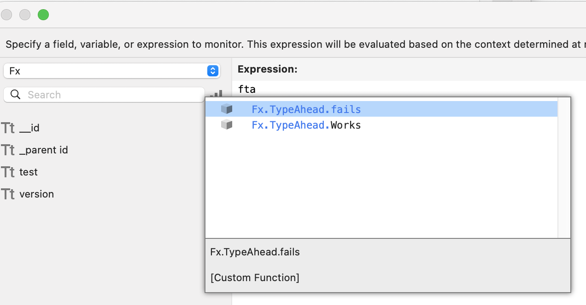
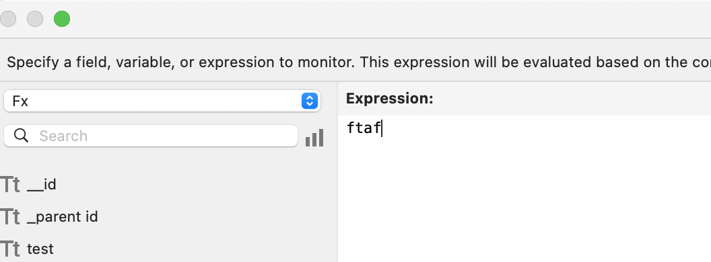
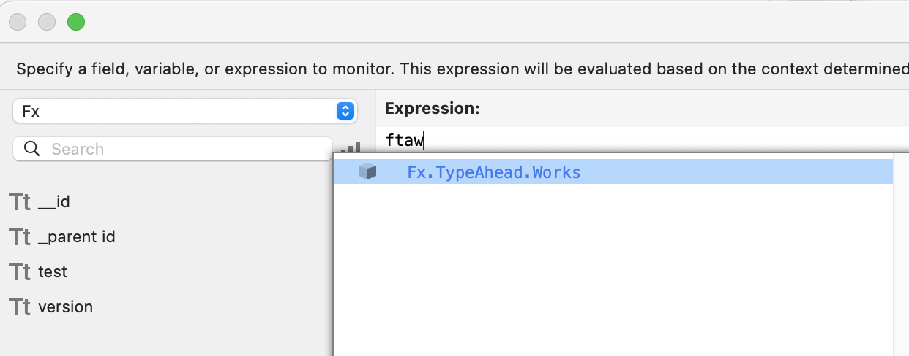
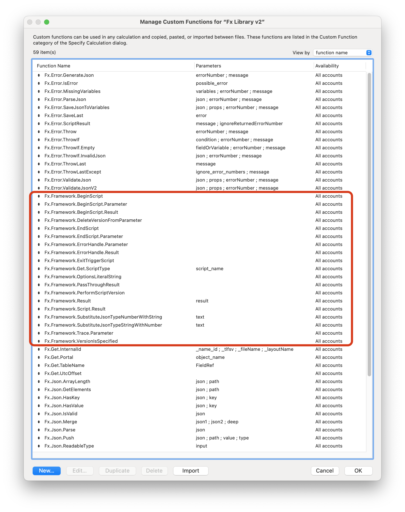

# Custom Functions

## Purpose

- Avoid duplication of code
- Constantly refine specific calculations
- If error occurs:
  - Currently returns error(s) as Array of Strings
    - Additional Custom Functions can parse to Error JSONObject 
  - In the future, may return "?"
    - This is expected behavior for FileMaker's built in Functions 

## Naming

- "Fx." prefix is company convention to differentiate from:
  - FileMaker's included Functions
  - Plugin Functions
    - Troi File plugin adds "TrFile_" Functions, like "TrFile_CopyFile"
- TitleCase so they support type-ahead in calculation window
  - "Fx.DoSomething.Cool" can be entered by typing "fdsc"
    - "Fx.DoSomething.cool" cannot
  - Acronyms must also be title case
    - "Fx.Json.Transform" not "Fx.JSON.Transform"
  - Type Ahead Concept
  
  - Type Ahead fails
  
  - Type Ahead succeeds
  
- Standardized Format
  - Clearly linked to Modules
  - User can guess how they would be used by reading name alone
  - Format (each section separated by ".")
    - "Fx"
    - Module Name
    - subModule(s)
    - Function / Use
    - For example:
      - Fx.Framework.ErrorHandle.Parameter
      - Fx.Framework.ErrorHandle.Result
  - When moving a module from one file to another
    - Move any Custom Functions that starts with "Fx.ThatModulesName..."
    - For example if moving the "Framework" Module to a new file
      - Move the Custom Functions that start with "Fx.Framework..." to the new file as well
       
       
[Back](Script_Naming.md) - [Next](Why_JSON.md)

[TOC](TOC.md)
