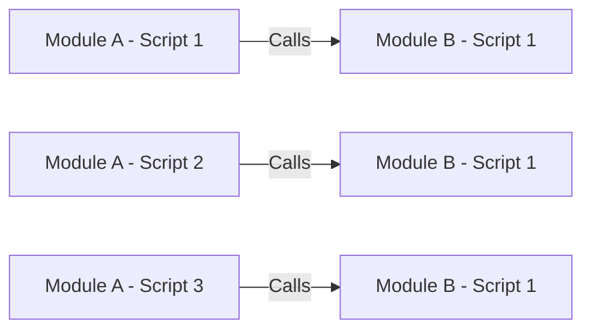
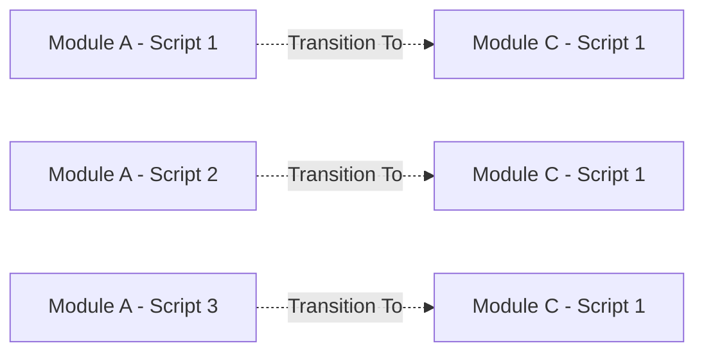
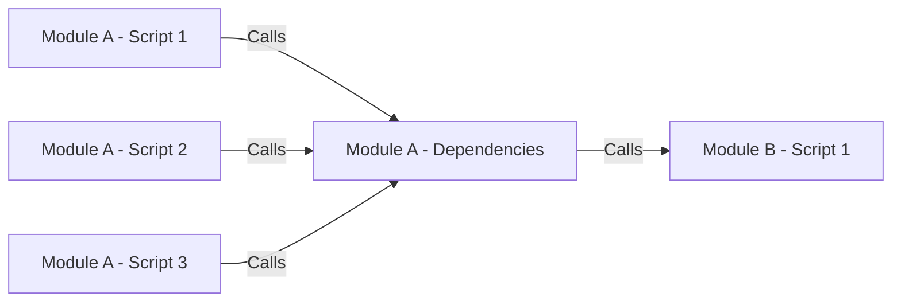
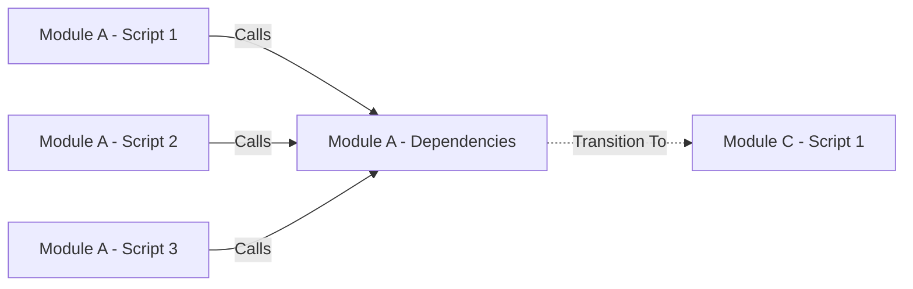

# Dependencies

## The Concept

Coding is always a balance between: 
- The desire to:
    - Improve on existing functions
    - Version them for testing
    - Roll out those improvements to the whole system
- The fear of:
    - Having to correct an ever-expanding list of references to the existing function
    - Missing a reference to an existing function
    - Having to roll back to a previous version of the function

## Without Framework

- References to Module B - Script 1 can be found anywhere in a Module A scattered amongst scripts
- If Module A is moved each of these references has to be repointed

## With Frameworks

- References to Module B - Script 1 can **ONLY** be found in the Dependencies folder in Module A
- If Module A is moved only this reference has to be repointed

[Back](Introduction.md) - [Next](Script_Functions_And_Types.md)

[TOC](TOC.md)
