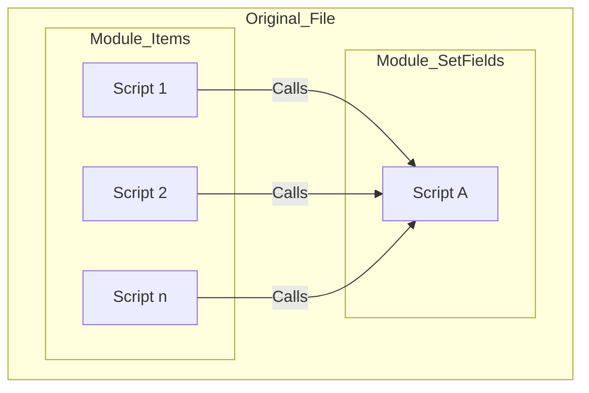
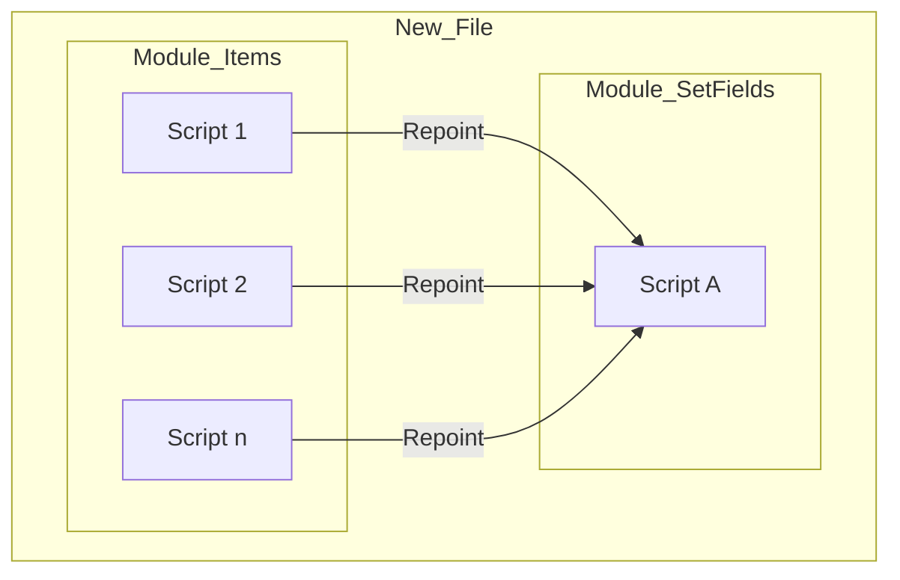
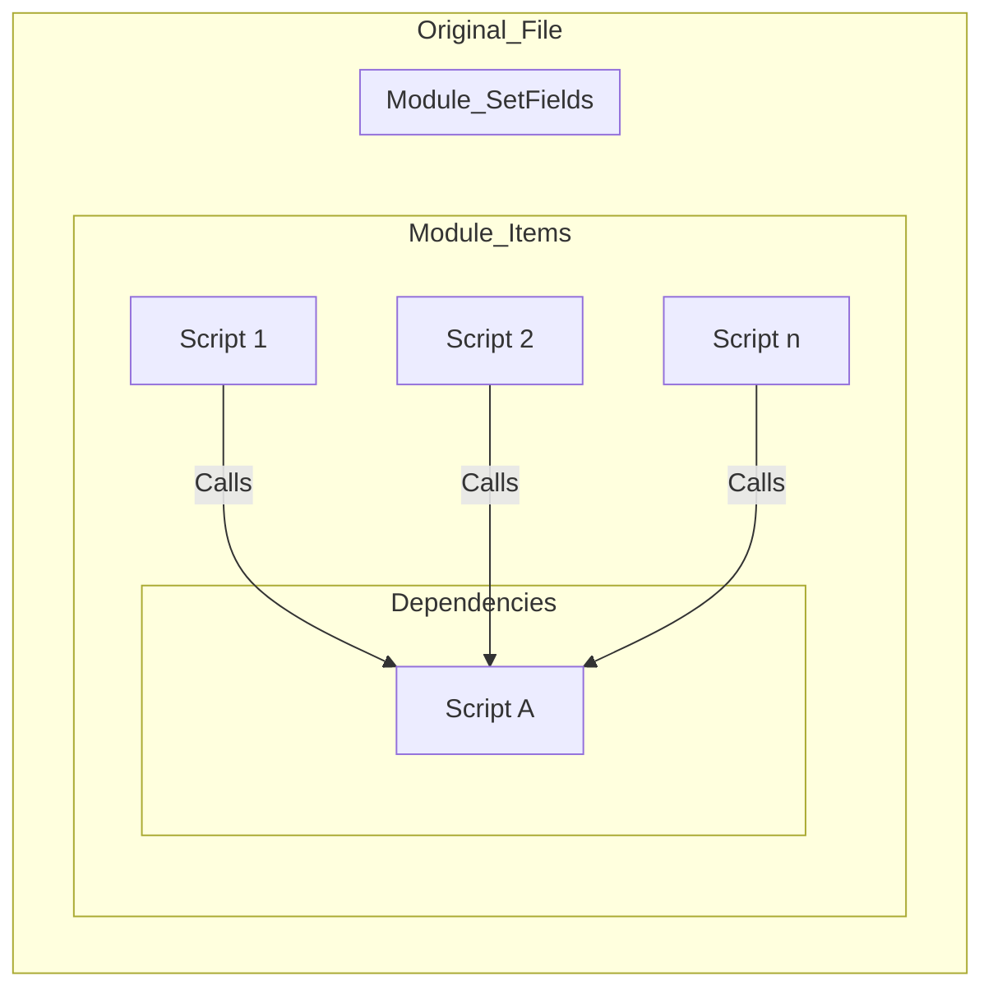

# Dependencies

## The Concept

Coding is always a balance between the desire to modularize code versus the fear of effectively managing references to the module.

To explore how FX Framework solves this conundrum, lets use an example.

The developer is refactoring their code and wants to move the Order_Items Module from the OrderItems file to the Orders file. Inside the Order_Items Module, there are 30 scripts that are dependent on scripts within the Set_Fields module (also inside the OrderItems file). Here is how that move plays out with FX Frameworks versus without...

## Without Framework

- Original_File with both modules
    - Multiple scripts in Module_Items call Script A in Module_SetFields

- Module_Items moved to New_File

- If Module_Items is moved from Original_File to New_File, **ALL** references to the Module_SetFields in the Original_File  break and have to be repointed.

## With Frameworks

- References to Original_File - Module_SetFields > Script A can **ONLY** be found in the Dependencies folder in Module_Items
- If Module A is moved only this reference has to be repointed

- Original_File with both modules
    - Multiple scripts in Module_Items call Script A in Module_SetFields

- Module - Items moved to New_File

- If Module_Items is moved from Original_File to New_File, **ALL** references to the Module_SetFields in the Original_File  break and have to be repointed.

[Back](Introduction.md) - [Next](Script_Functions_And_Types.md)

[TOC](TOC.md)
