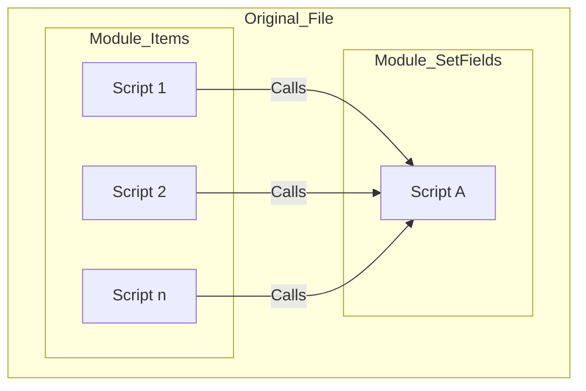
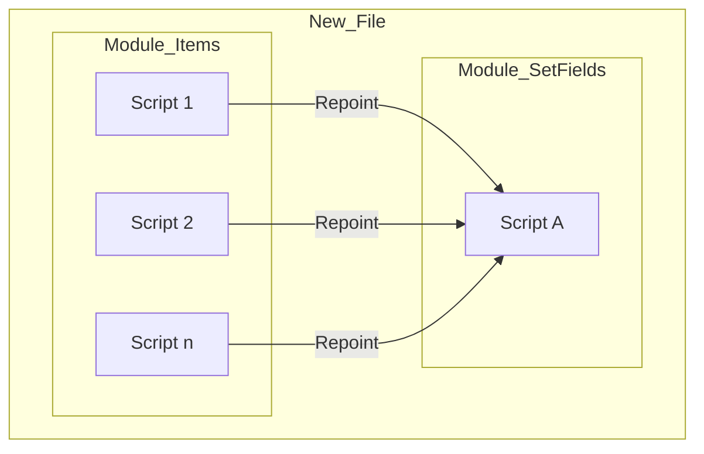
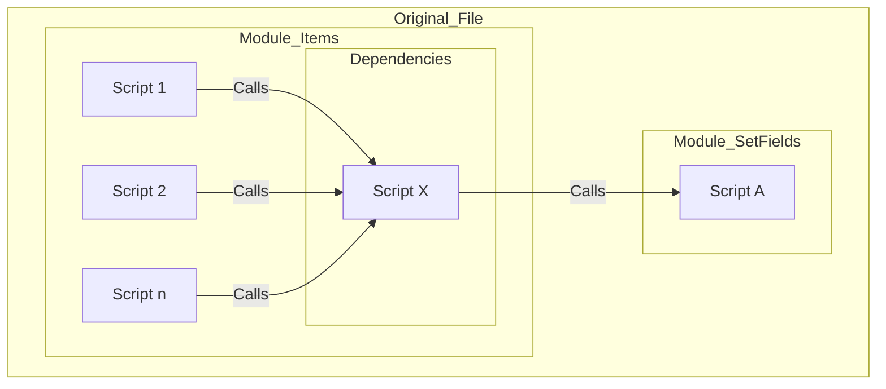
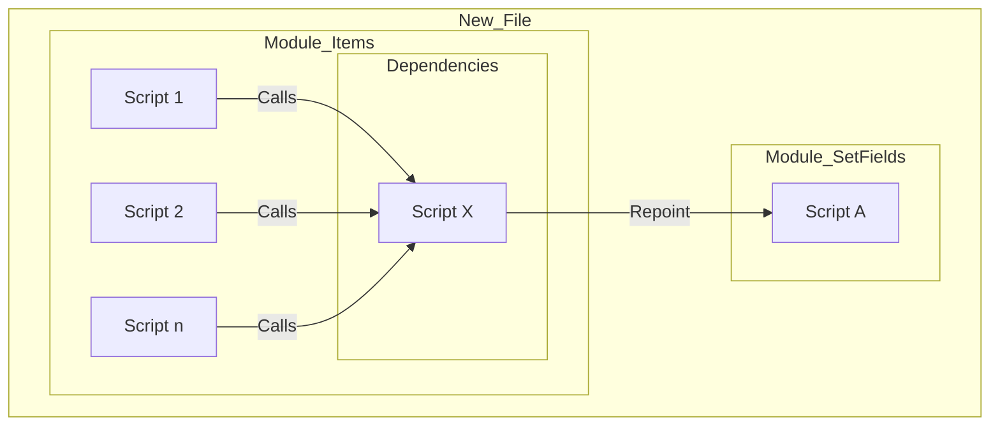

# Dependencies

## The Concept

Coding is always a balance between the desire to modularize code versus the fear of effectively managing references to the module.

To explore how FX Framework solves this conundrum, lets use an example...

- The developer is refactoring their code and wants to move the Module_Items from the Original_File to the New_File. 
- Inside Module_Items, there are 30 scripts that are dependent on Script A within the Original_File Module_SetFields module.
- Here is how that move plays out with FX Frameworks versus without...

## Without Framework

- Original_File with both modules
    - Multiple scripts in Module_Items call Script A in Module_SetFields

- Module_Items moved to New_File with existing Module_SetFields
    - **All** the scripts in Module_Items that call Script A in Module_SetFields have to be repointed

## With Frameworks

- Original_File with both modules
    - Multiple scripts in Module_Items call Script X in Dependencies submodule which then calls Script A in Module_SetFields

- Module_Items moved to New_File with existing Module_SetFields
    - Only Script X in Dependencies submodule has to be repointed to Script A in Module_SetFields

## Summary

- Moving Modules between files in Frameworks, **ONLY** requires reference repointing in the Dependencies subfolder.

[Back](Introduction.md) - [Next](Script_Functions_And_Types.md)

[TOC](TOC.md)
