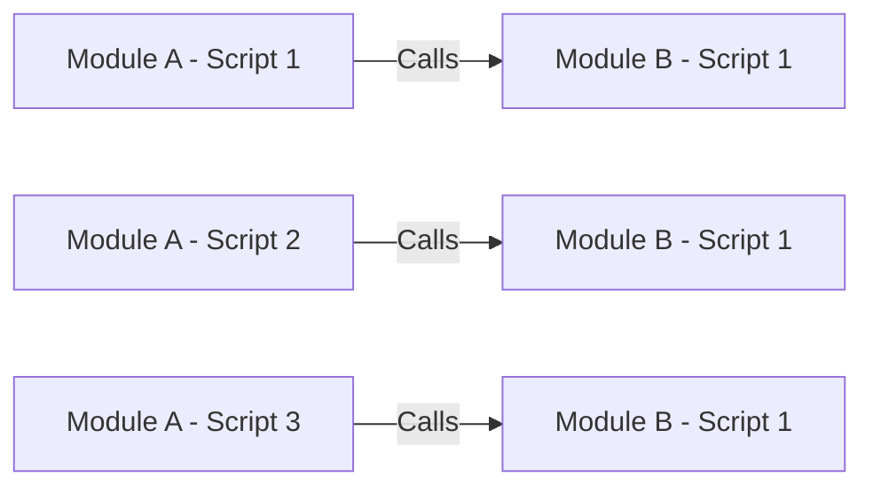
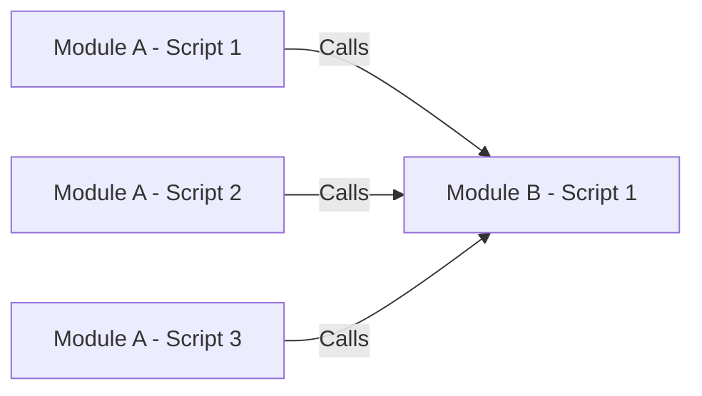

# Dependencies

## Common Dependencies

- References to Module B - Script 1 can be found anywhere in a Module A scattered amongst scripts
- If Module A is moved each of these references has to be repointed

## Frameworks Dependencies

- References to Module B - Script 1 can be found in one place in Module A
- If Module A is moved only this reference has to be repointed

[Back](Introduction.md) - [Next](Script_Functions_And_Types.md)

[TOC](TOC.md)
