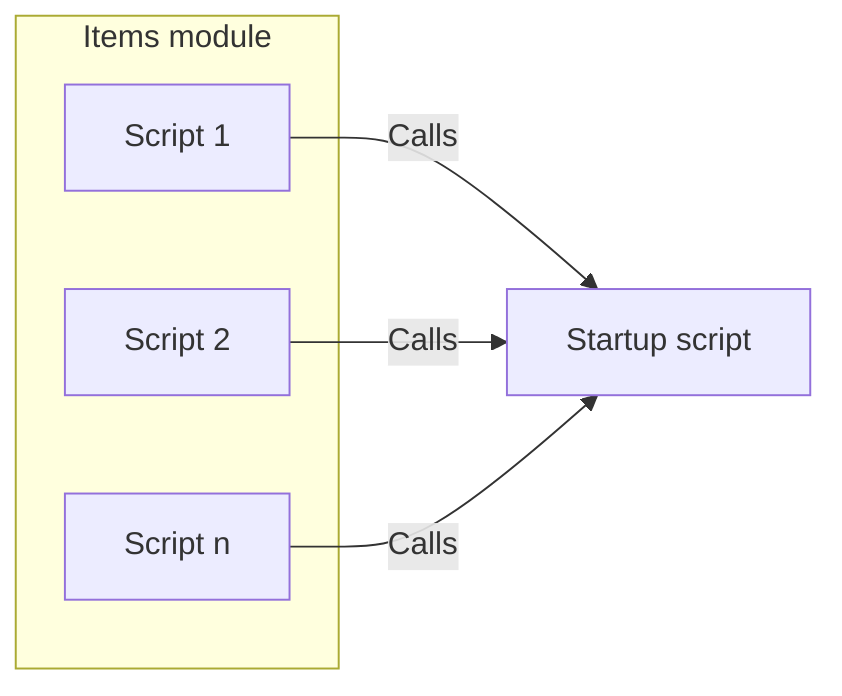
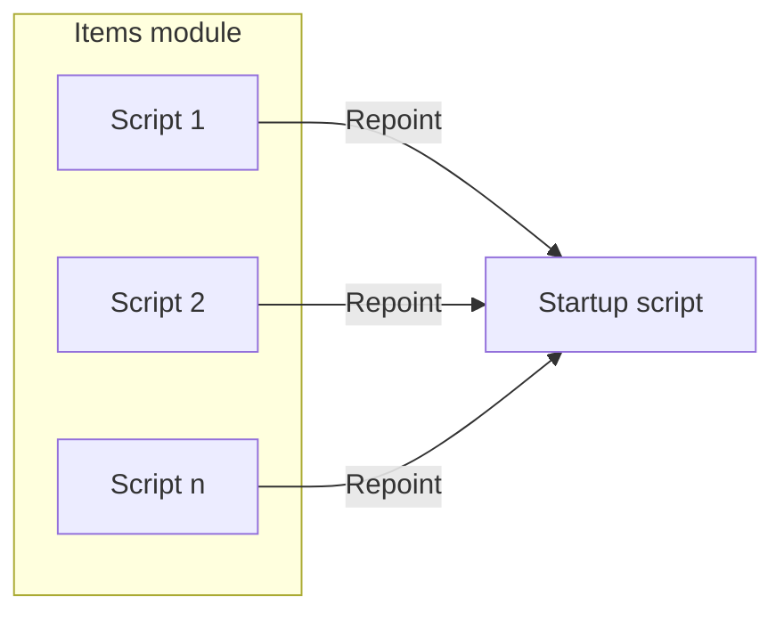
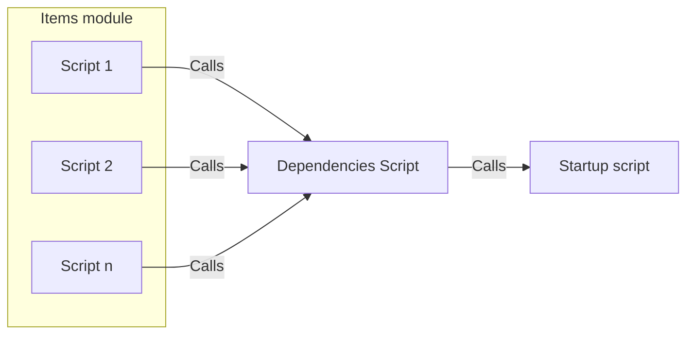
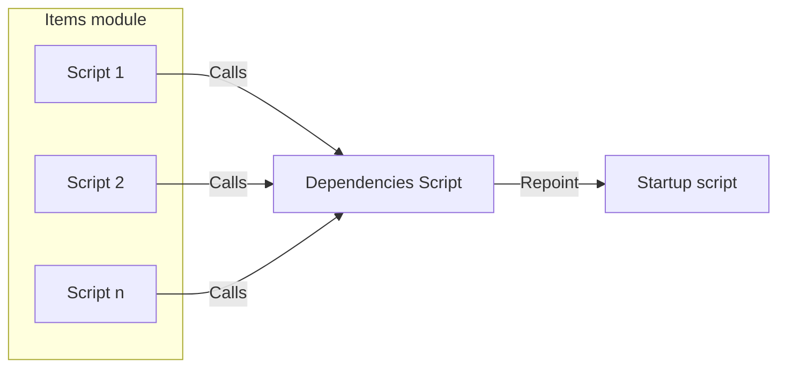

# Dependencies

## The Concept

Coding is always a balance between the desire to modularize code versus the fear of effectively managing references to the module.

To explore how FX Framework solves this conundrum, lets use an example...

- The developer is reusing their code and wants to move the Items module from file A to the file B. 
- Inside Items module, there are *n* number of scripts that are dependent on the Startup script
- Here is how that move plays out with FX Frameworks versus without...

## Without Framework

- Original file
    - Multiple scripts in Items module call the Startup script

- New file
    - **All** these scripts have to be repointed to the Startup script in the New file

## With Frameworks

- Original file
    - Multiple scripts in Items module call the Dependencies Script which calls the Startup script

- New file
    - Only Dependencies Script has to be repointed to the Startup script in the New file

## Takeaways

- Moving Modules between files in Frameworks, **ONLY** requires reference repointing in the Dependencies subfolder, which allows for true modularity. 
- True Modularity is impossible without this feature

[TOC](TOC.md)
