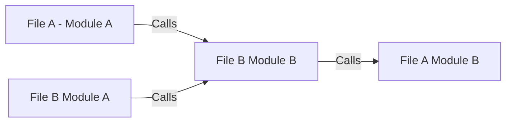

# Dependencies

## The Concept

Coding is always a balance between: 
- The desire to:
    - Modularize code
- The fear of:
    - Having references into and out of the module can be brittle

## Without Framework

- File A Module A references File A Module B

- If Module A is moved from File A to File B, references to Module B break

## With Frameworks

- References to File A - Module B can **ONLY** be found in the Dependencies folder in Module A
- If Module A is moved only this reference has to be repointed

[Back](Introduction.md) - [Next](Script_Functions_And_Types.md)

[TOC](TOC.md)
