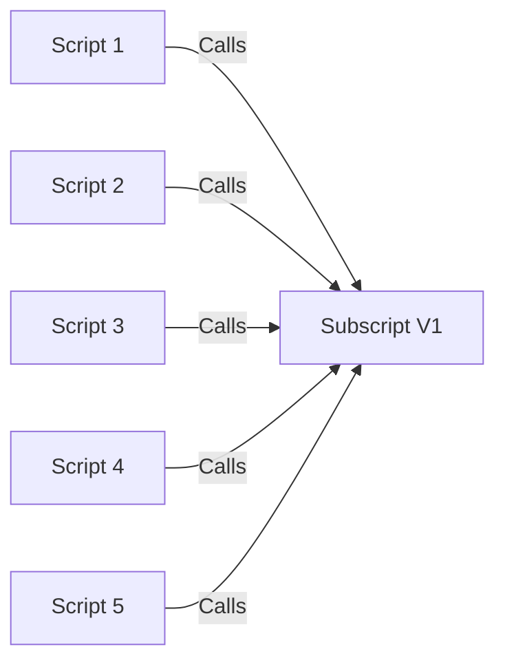
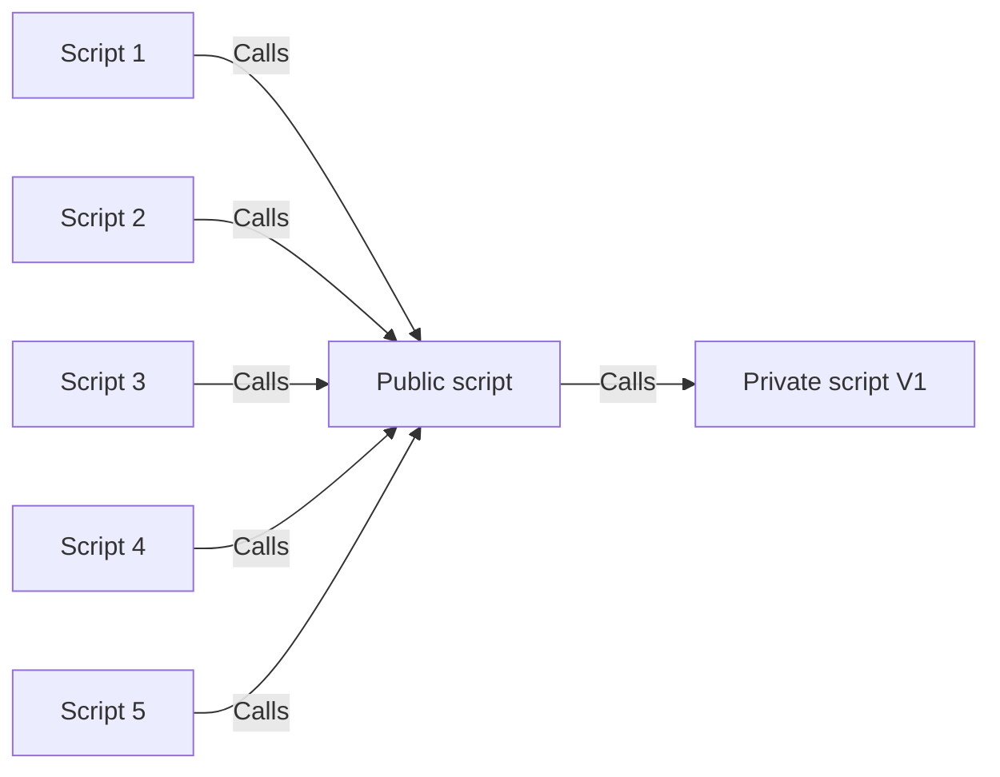

# Dependencies

## Common Dependencies

- XXX

```mermaid
graph LR
A[Script 1] -- Calls --> F[Subscript V1] 
B[Script 2] -- Calls --> F
C[Script 3] -- Calls --> F
D[Script 4] -- Calls --> F
E[Script 5] -- Calls --> F
```

## Frameworks Dependencies

- XXX

```mermaid
graph LR
    A[Script 1] -- Calls --> F[Public script] -- Calls --> G[Private script V1]
    B[Script 2] -- Calls --> F
    C[Script 3] -- Calls --> F
    D[Script 4] -- Calls --> F
    E[Script 5] -- Calls --> F
```

[Back](Introduction.md) - [Next](Script_Functions_And_Types.md)

[TOC](TOC.md)
