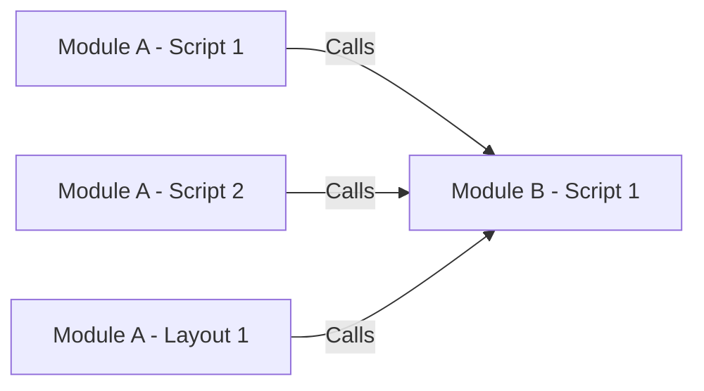
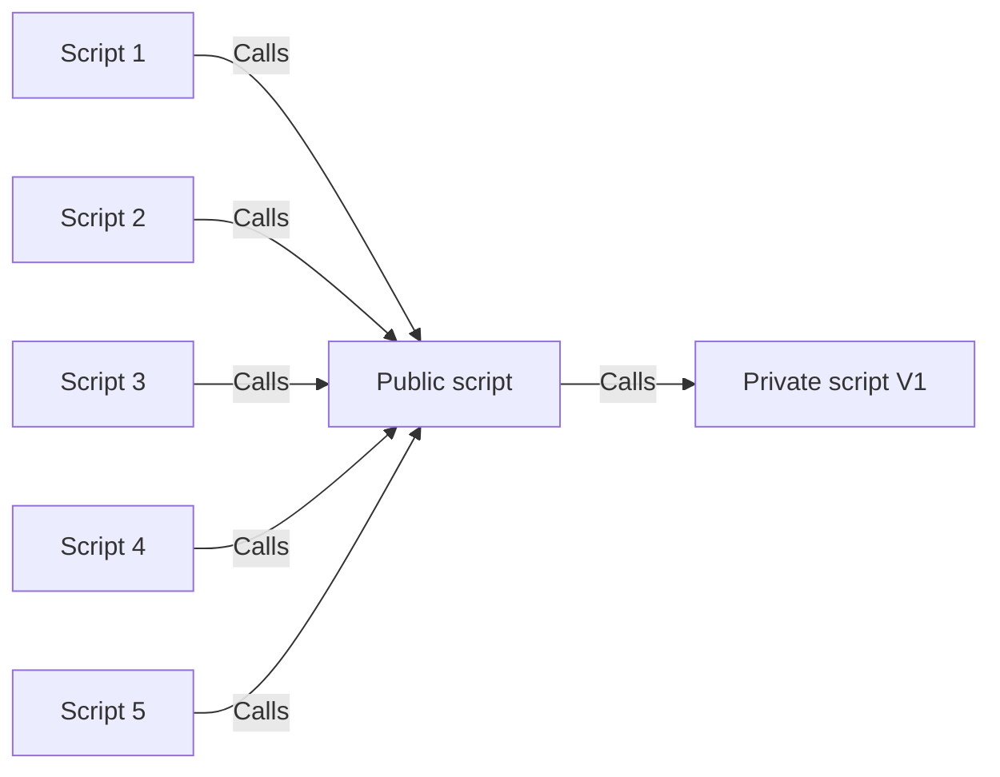

# Dependencies

## Common Dependencies

- Found anywhere in a Module scattered amongst scripts

## Frameworks Dependencies

- XXX

[Back](Introduction.md) - [Next](Script_Functions_And_Types.md)

[TOC](TOC.md)
