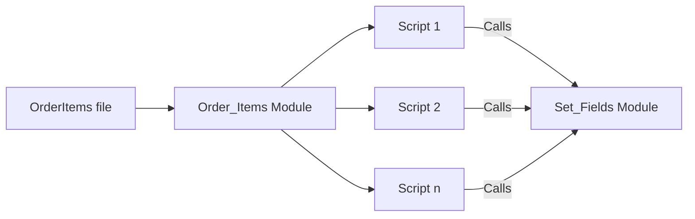
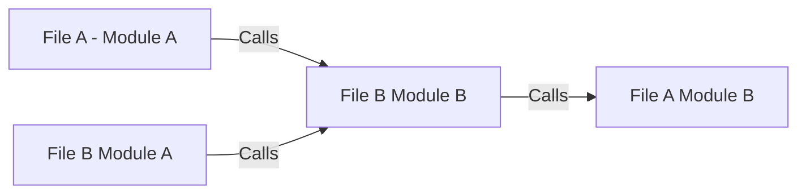

# Dependencies

## The Concept

Coding is always a balance between the desire to modularize code versus the fear of effectively managing references to the module.

To explore how FX Framework solves this conundrum, lets use an example.

The developer is refactoring their code and wants to move the Order_Items Module from the OrderItems file to the Orders file. Inside the Order_Items Module, there are 30 scripts that are dependent on scripts within the Set_Fields module (also inside the OrderItems file). Here is how that move plays out with FX Frameworks versus without...

## Without Framework

- Order_Items file with both modules

- If Order_Items Module is moved from OrderItems File to Orders File, references to the SetFields Module in the Order_Items file break

## With Frameworks

- References to File A - Module B can **ONLY** be found in the Dependencies folder in Module A
- If Module A is moved only this reference has to be repointed

[Back](Introduction.md) - [Next](Script_Functions_And_Types.md)

[TOC](TOC.md)
