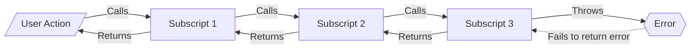
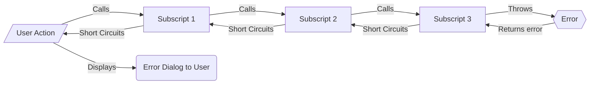

# Error Trapping and Returning

## Common Coding

In common coding practices, if an error is thrown by a subscript it is **NOT** caught and therefore doesn't shortcircuit any calling scripts

## Frameworks Coding

In Frameworks coding practices, if an error is thrown by a subscript it **IS** caught, short circuits any calling scripts, and displays a meaningful error to the user.

