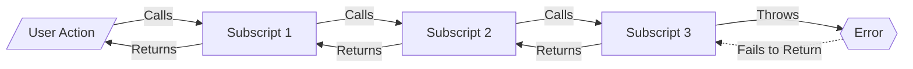
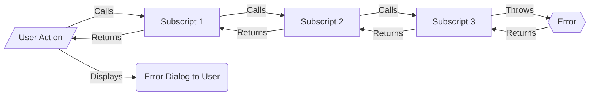

## Common Coding

If an error is thrown by a subscript

```mermaid
graph LR
    A[/User Action/] -- Calls --> B[Subscript 1] 
    B -- Calls --> C[Subscript 2] 
    C -- Calls --> D[Subscript 3] 
    D -- Throws --> E{{Error}}
    E -.Fails to Return.-> D
    D -- Returns --> C
    C -- Returns --> B
    B -- Returns --> A
```
## Frameworks Coding

```mermaid
graph LR
    A[/User Action/] -- Calls --> B[Subscript 1] 
    B -- Calls --> C[Subscript 2] 
    C -- Calls --> D[Subscript 3] 
    D -- Throws --> E{{Error}}
    E -- Returns --> D
    D -- Returns --> C
    C -- Returns --> B
    B -- Returns --> A
    A -- Displays --> F(Error Dialog to User)
```
