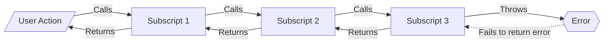
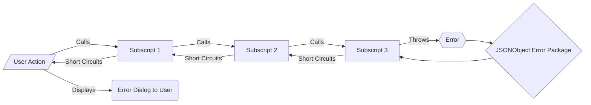

# Error Trapping and Returning

## Common Coding

In common coding practices:
- Error thrown by subscript
- **NOT** caught
- Therefore doesn't shortcircuit any calling scripts

## Frameworks Coding

In Frameworks coding practices:
- Error is thrown by a subscript
- **IS** caught
- Short circuits any calling scripts
- Displays a meaningful error to the user.

