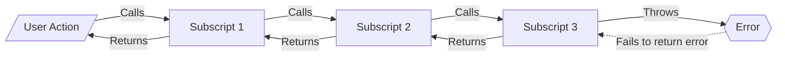
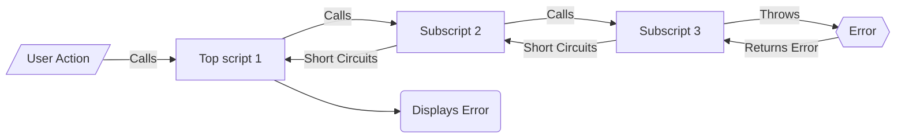
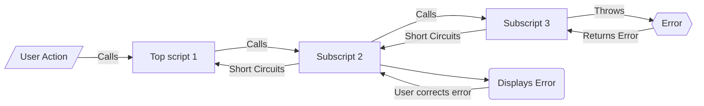

# Error Trapping and Returning

## Without Framework

- Subscript has an error
- Error is **NOT** passed to calling script
- Calling scripts then proceed normally
  - This can have unintended consequences

## With Frameworks

- Subscript has an error
- Error passed to calling script as JSONObject error package
- Calling scripts short circuit
- Human-readalbe error is displayed in one of two ways:

#### Top script — lets user know task did not complete

---

#### Subscript — allows user to correct error so function can complete

---

[Back](Introduction.md) - [Next](Script_Functions_And_Types.md)

[TOC](TOC.md)
