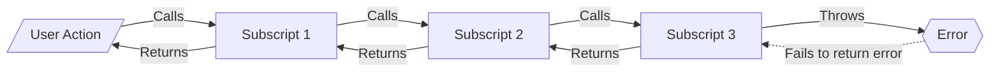
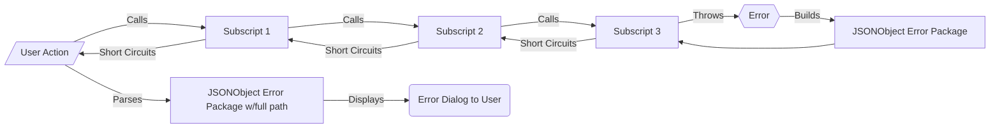
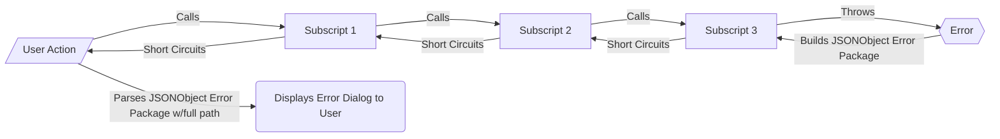

# Error Trapping and Returning

## Common Coding

In common coding practices:
- Error thrown by subscript
- **NOT** caught
- Therefore doesn't shortcircuit any calling scripts
  - Which may have unexpected outcomes

## Frameworks Coding

In Frameworks coding practices:
- Error is thrown by a subscript
- **IS** caught
- Returned as JSONObject Error Package (aka JEP)
  - Includes script name
  - Human-readable error
  - FileMaker error code
- Short circuits any calling scripts
  - Which add their script name to JEP
  - Pass JEP to their calling script 
- Top script calls JEP parsing rountine
- Then calls a routine which displays:
  - showing human-readable and actionable error text
  - showing full path of error through scripts
    - not just script that threw error

[Back](Introduction.md) - [Next](Script_Functions_And_Types.md)

[TOC](TOC.md)
