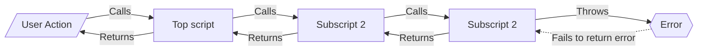
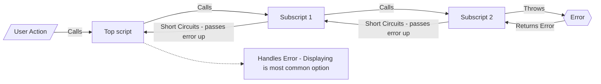

# Error Trapping and Returning

## Without Framework

- Subscript has an error
- Error is **NOT** passed to calling script
  - Or error is passed to calling script, but calling script does not check for it and does not handle it
- Calling scripts then proceed normally
  - This can have unintended consequences

## With Frameworks

- Subscript has an error
- Error passed up to calling script as JSONObject error package
- Error short circuits calling script with two possible options:
  - Display error to user (sometimes with option to correct and continue)
  - Or just pass the error up to its calling script

## Summary

- In Frameworks, Errors are captured in subscripts, passed up subscript stack, and are handled by stopping normal execution and displaying error to user if appropriate.

[Back](Introduction.md) - [Next](Script_Functions_And_Types.md)

[TOC](TOC.md)
