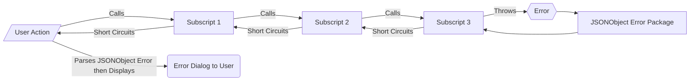

# Error Trapping and Returning

## Common Coding

In common coding practices:
- Error thrown by subscript
- **NOT** caught
- Therefore doesn't shortcircuit any calling scripts
  - Which may have unexpected outcomes

## Frameworks Coding

In Frameworks coding practices:
- Error is thrown by a subscript
- **IS** caught
- Packaged in JSONObject
  - Including script name
- Short circuits any calling scripts
  - Which add their script name to error stack
  - Pass error to their calling script 
- Displays a meaningful error to the user
  - showing human-readable and actionable error text
  - showing full path of error through scripts
    - not just script that threw error

[Back](Introduction.md) - [Next](Script_Functions_And_Types.md)

[TOC](TOC.md)
