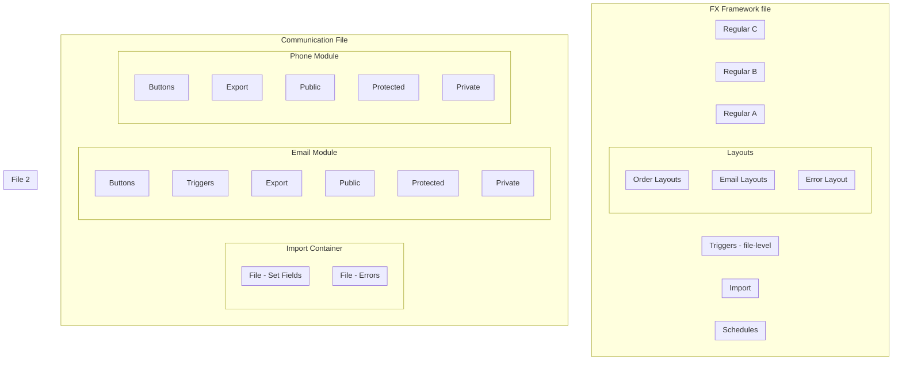

# Mermaid Test file

```mermaid
flowchart TB
  subgraph FX Framework file
  subgraph Schedules
  end
  subgraph Import
  end
  subgraph Triggers - file-level
  end  
  subgraph Layouts
  subgraph Error Layout
  end
  subgraph Email Layouts
  end
  subgraph Order Layouts
  end
  end
  subgraph Regular A
  end
  subgraph Regular B
  end
  subgraph Regular C
  end
  end
  subgraph Communication File
  subgraph Import Container
  direction TB
  subgraph File - Errors
  end
  subgraph File - Set Fields
  end
  end
  subgraph Email Module
  direction TB
  A[Buttons]
  B[Triggers]
  C[Export]
  D[Public]
  E[Protected]
  F[Private]
  end
  subgraph Phone Module
  G[Buttons]
  H[Export]
  I[Public]
  J[Protected]
  K[Private]
  end
  end
  subgraph File 2
  end
```
