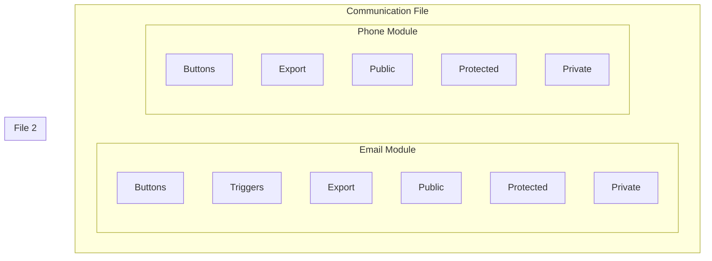

# Mermaid Test file

```mermaid
flowchart TB
  subgraph Communication File
  subgraph Email Module
  A[Buttons]
  B[Triggers]
  C[Export]
  D[Public]
  E[Protected]
  F[Private]
  end
  subgraph Phone Module
  G[Buttons]
  H[Export]
  I[Public]
  J[Protected]
  K[Private]
  end
  end
  subgraph File 2
  end
```
