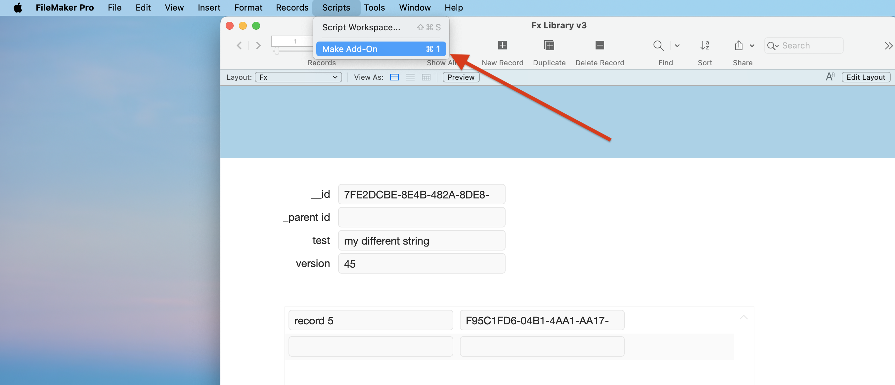
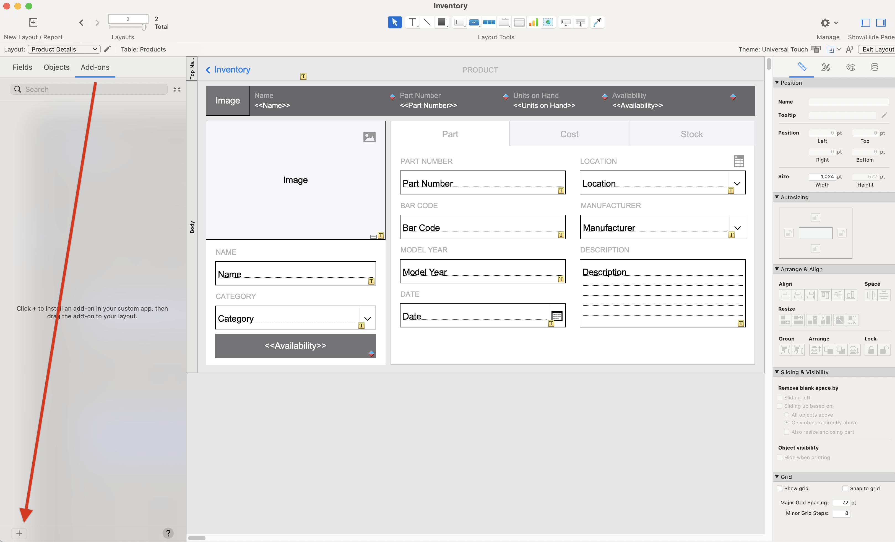
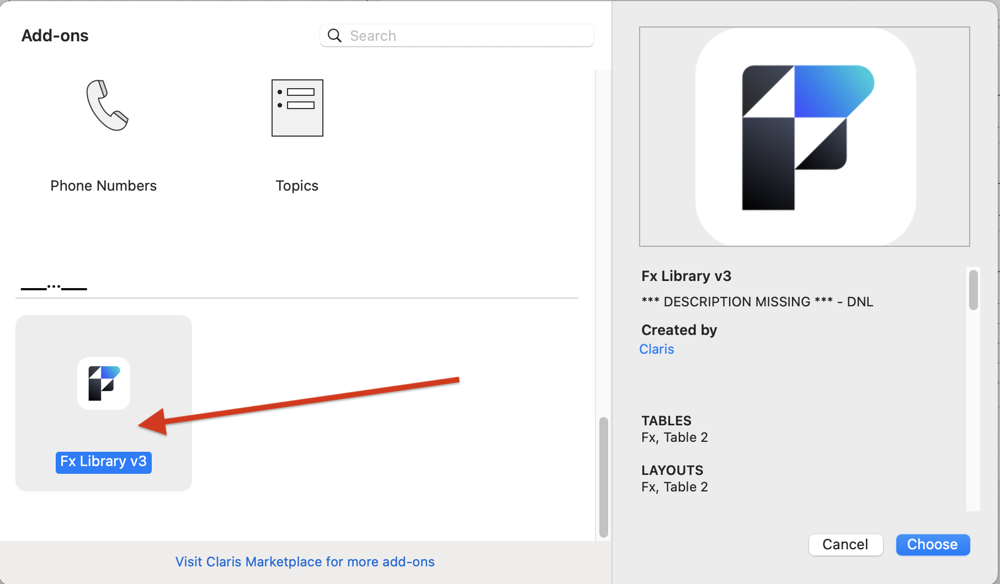
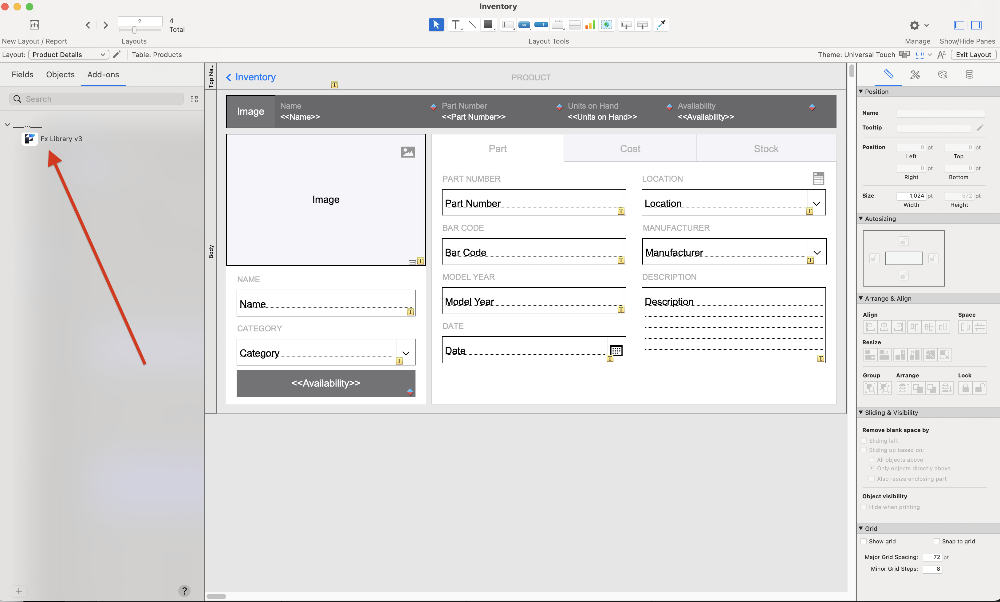

### FX Framework

#### What is it?

FX Framework is a FileMaker Add-on scripting structure and methodology which is transactional, extensible, and fully error-trapped. It contains a library of commonly-needed functions which allow the developer to concentrate on building out the business logic, instead of rewriting an error-trapping field setter for each file (for example).

#### Why use it?

FX Framework has many advantages over common FileMaker scripting methodologies:
- The FX Framework can be installed as an Add-on for every file in a new or existing solution.
- Data editing functions are fully transactional and able to be rolled back if they encounter any errors
- Results are returned in a predictable JSONObject format.
- Errors are consistently trapped and returned in a predictable JSONObject format.
	- Any trapped errors include the full error stack — from the calling script all the way down to the subscript that encountered the error.
- Scripts are easily versioned and can also be rolled back if testing proves the new version is not working as expected.

#### How to install it?

The FX Framework can be added to any new or existing FileMaker file as an Add-on, which will install some clearly labeled tables and relationships, layouts, custom functions and scripting.

Instructions:
- Open the FX Framework file and run the Make Add-on script which will ask from which window to create the app (type for example, "Fx Library v3")

- Choose to replace UUID, and confirm it. %% (Is this correct Kaz?) %%
- Open the destination file
- Enter Layout Mode
	- Enable the left pane and click the Add-ons tab

- Click the "+" button
	- > Is there a reason why the FX Framework Add-on does not have a descripttion or section?

- Then confirm that it worked

#### How to use it?

