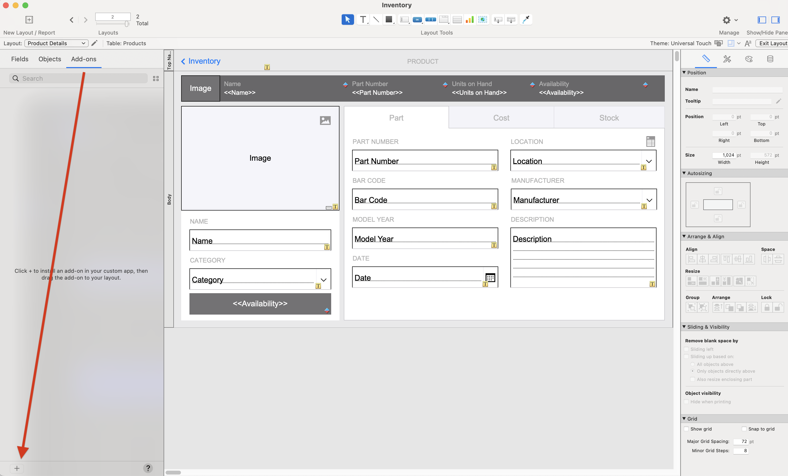
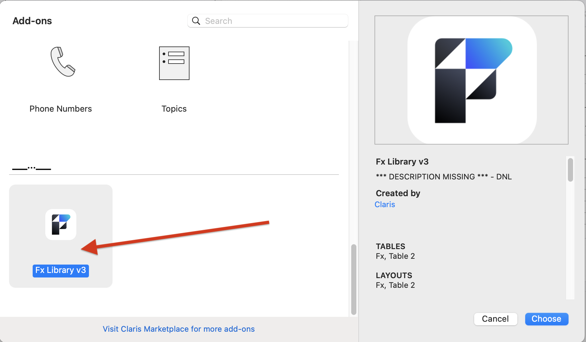
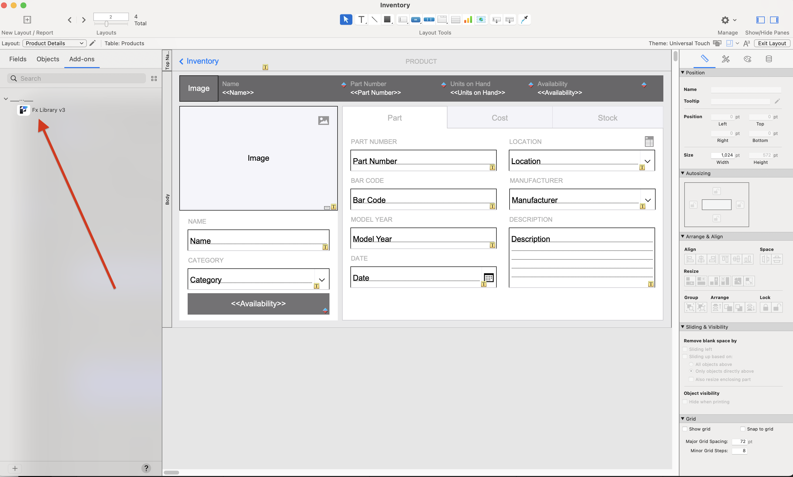
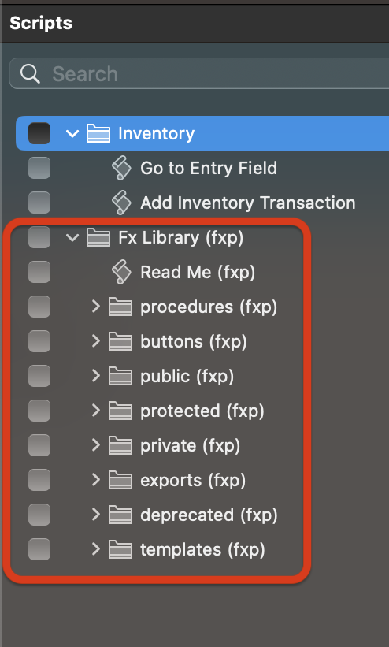

## FX Framework

### TOC
- [What is it?](#what)
- [Why use it?](#why)
- [How is it installed?](#how)
- [RTFM!](#rtfm)
- [Incorporate](#incorporate)

#### What is it? 

FX Framework is a FileMaker Add-on scripting structure and methodology which is transactional, extensible, and fully error-trapped. 

It contains a library of commonly-needed functions which allow the developer to concentrate on building out their business logic, instead of repeatedly rewriting an error-trapping field setter for each file (for example).

- FX Framework will install:
	- Tables
	- Relationships
	- Layouts
	- Custom Functions
	- Sripting

- FX Framework will NOT install:
	- Security
	- Value Lists
	- External Data Sources
	- Containers or a Container directory structure
	- Custom Menus
	- Themes

#### Why use it? 

FX Framework has many advantages over common FileMaker scripting methodologies:
- The FX Framework can be installed as an Add-on for every file in a new or existing solution.
- Data editing functions are fully transactional and able to be rolled back if they encounter any errors
- Results are returned in a predictable JSONObject format.
- Errors are consistently trapped and returned in a predictable JSONObject format.
	- Any trapped errors include the full error stack — from the calling script all the way down to the subscript that encountered the error.
- Scripts are easily versioned and can also be rolled back if testing proves the new version is not working as expected.

#### How is it installed?

Instructions:
- Open the FX Framework file and run the Make Add-on script which will ask from which window to create the app (type for example, "Fx Library v3")

- Choose to replace UUID, and confirm it. %% (Is this correct Kaz?) %%
- Open the destination file
- Enter Layout Mode
	- Enable the left pane and click the Add-ons tab



- Click the "+" button

> Is there a reason why the FX Framework Add-on does not have a descripttion or section?



- Then confirm that it worked



- The most obvious sign that FX Framework was installed successfully will be the extensive folder structure under the FX folder in the Manage Scripts Menu.



#### RTFM!

First thing to note is that the Framework is fully self-documenting and the documentation of any script can be obtained by calling that script with this JSON call:

```
JSONSetElement ( "{}" ; "fx_options" ; True ; JSONBoolean ) 
```

For example:

```
Perform Script [Specified: From list; "sub: simple email (fxp)" ; Parameter: JSONSetElement ( "{}" ; "fx_options" ; True ; JSONBoolean ) ]
```

Which will produce a documentation JSONObject:

```
{
	"begin" : {},
	"end" : {},
	"error_handling" : 
	{
		"display" : false,
		"revert" : false
	},
	"parameters" : 
	{
		"paths" : 
		{
			"attachment_path" : 
			{
				"description" : "path to the item to attach",
				"save_to_variable" : "$attachment_path",
				"type" : "JSONString",
				"variable_type" : "text"
			},
			"bcc" : 
			{
				"description" : "blind carbon copy recipients. can be array of strings",
				"save_to_variable" : "$bcc",
				"type" : [ "JSONString", "JSONArray" ],
				"variable_type" : "text"
			},
			"cc" : 
			{
				"description" : "carbon copy recipients. can be array of strings",
				"save_to_variable" : "$cc",
				"type" : [ "JSONString", "JSONArray" ],
				"variable_type" : "text"
			},
			"message" : 
			{
				"description" : "text of the message to email.",
				"save_to_variable" : "$message",
				"type" : "JSONString",
				"variable_type" : "text"
			},
			"smtp_settings" : 
			{
				"custom_type" : "{{$smtp_definition}}",
				"description" : "smtp settings",
				"save_to_variable" : "$smtp_settings",
				"type" : [ "JSONString", "JSONObject" ],
				"variable_type" : "text"
			},
			"subject" : 
			{
				"description" : "message subject.",
				"save_to_variable" : "$subject",
				"type" : "JSONString",
				"variable_type" : "text"
			},
			"to" : 
			{
				"description" : "recipients. can be array of strings",
				"save_to_variable" : "$to",
				"type" : [ "JSONString", "JSONArray" ],
				"variable_type" : "text"
			}
		},
		"required_paths" : [ "message", "subject", "to" ]
	},
	"script" : 
	{
		"description" : "simple email sending script. sends text over smtp. cannot send HTML emails.",
		"id" : "59",
		"name" : "sub: simple email (fxp) v1",
		"type" : "subscript"
	},
	"updates" : 
	[
		"created on 2022-12-28 By Kaz",
		"updated 2022-12-27 updated to use self-documenting framework."
	]
}
```

#### Incorporate

