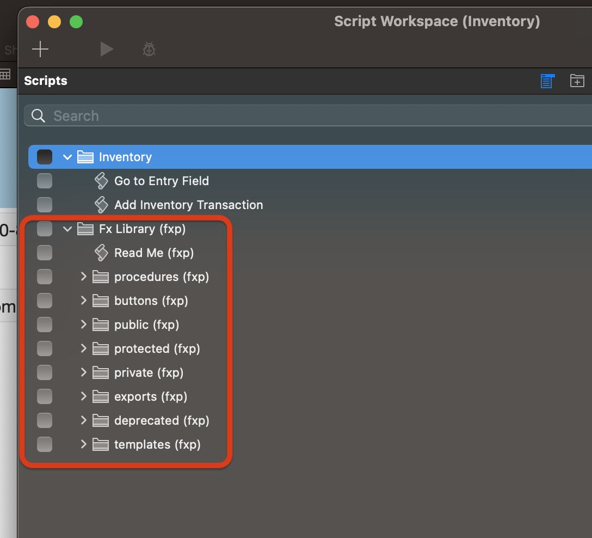

## FX Framework Add-on


### Overview 
The FX Framework is a FileMaker Add-on which provides developers with a scripting structure that supports the following critical functions for any coding environment:

- stacked transactions
- foolproof script version deploying and rollbacks
- full error trapping, returning and displaying when desired

These strengths enable developers to focus on their business logic, rather than constantly having to rebuilding common scripts. The Framework Add-on only installs:

- Tables
- Relationships
- Layouts
- Custom Functions
- Scripting

### Benefits

FX Framework has many advantages over common FileMaker scripting structures and methodologies:
- The FX Framework is installed as an Add-on for every file in a new or existing solution.
- Data manipulation is fully transactional and therefore able to be rolled back if any errors are encountered
- Results are returned in a predictable JSONObject format.
- Errors are consistently trapped and returned in a predictable JSONObject format.
	- Any trapped errors include the full error stack — from the calling script all the way down to the subscript that encountered the error.
- Scripts are easily versioned and can also be rolled back if testing proves the new version is not working as expected.

### Installation Confirmation

To confirm the Add-on was installed correctly, check for the FX folder structure in the Script Workspace.



### RTFM!

The scripts in the FX Framework are fully self-documenting by calling any of them with this parameter:

```
JSONSetElement ( "{}" ; "fx_options" ; True ; JSONBoolean ) 
```

For example:

```
Perform Script [Specified: From list; "sub: set all fields (fxp)" ; Parameter: JSONSetElement ( "{}" ; "fx_options" ; True ; JSONBoolean ) ]
```

Which will produce a documentation JSONObject:

```
{
	"begin" : 
	{
		"allow_abort" : false,
		"capture_errors" : true
	},
	"end" : {},
	"error_handling" : 
	{
		"display" : false,
		"revert" : false
	},
	"parameters" : 
	{
		"paths" : 
		{
			"fields" : 
			{
				"description" : "Object of local fields to set.",
				"save_to_variable" : "$fields",
				"type" : "JSONObject",
				"variable_type" : "text"
			},
			"portal_name" : 
			{
				"description" : "name of the active portal we're setting fields in, using internally for recursion.",
				"save_to_variable" : "$portal_name",
				"type" : "JSONString",
				"variable_type" : "text"
			},
			"portals" : 
			{
				"description" : "Array of portal objects to set.",
				"save_to_variable" : "$portals",
				"type" : "JSONArray",
				"variable_type" : "text"
			}
		},
		"required_paths" : []
	},
	"script" : 
	{
		"description" : "Script to transactionally set fields. will also update related records in portals. capable of matching related rows based upon an id.",
		"id" : "63",
		"name" : "sub: set all fields (fxp) v1",
		"type" : "subscript"
	},
	"updates" : 
	[
		"created on 2022-12-28 by Kaz",
		"updated YYYY-MM-DD by DEVELOPER NAME: changed x, y, and z."
	]
}
```

### How to incorporate the Framework

