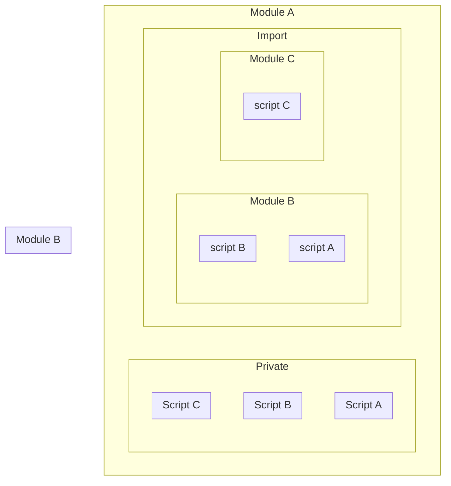

# Dependencies Comparison

```mermaid
flowchart TB
  subgraph Module A
    subgraph Private
      subgraph Script A
      end
      subgraph Script B
      end
      subgraph Script C
      end      
    end
    subgraph Import
      subgraph Module B
        subgraph script A
        end
        subgraph script B
        end
      end
      subgraph Module C
        subgraph script C
        end
      end
    end
  end
  
  subgraph Module B
  subgraph Import
  end
  end
```
