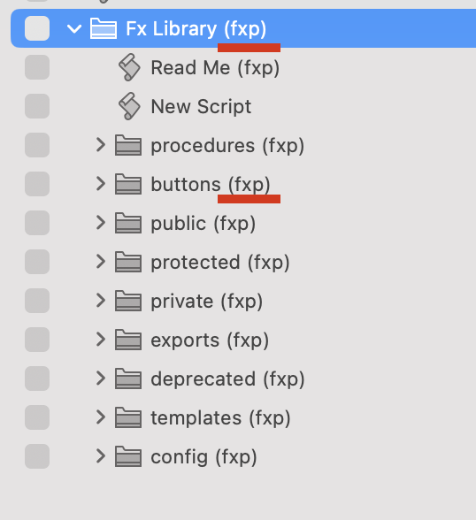
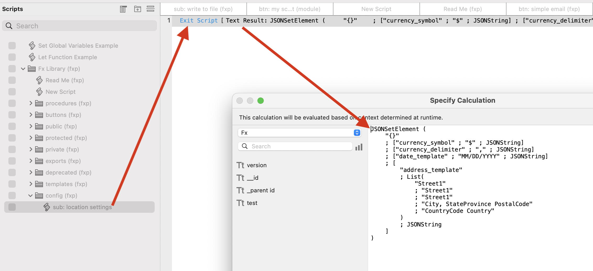

# Script Folders - Module
- Modules are script folders
- Modules can contain subfolders and/or Sub-Modules
- Modules present certain tools to the developer
- Each subfolder type serves a specific purpose
- Each subfolder has a suffix which matches the suffix of its parent module
  - This is to differentiate the subfolders which would otherwise all have the same name across Modules

## Two Types of Modules
- Standard
  - These are the standard Module folder that provide specific functionality
  - There can be any number of these
- Grouped Module
  - Contain:
    - Individual Sub-Modules
    - Shared Dependencies folder
      - Removes Dependencies folders inside each Sub-Module
  - Example of this is Layouts module which looks like this:
    - Layouts
      - Dependencies
      - Layout A
      - Layout B
      - Layout C
  - Sub-Modules can use Dependencies of Parent Module

## Module Subfolder Structure

- Module
  - Buttons
  - Procedures
  - Triggers
  - Export
  - Public
  - Protected
  - Private
  - Dependencies
  - Config
  - Templates
  - Deprecated 

## Subfolder Details

- Buttons
  - Can contain logic based on context or user input
    - Too specific to push into subscript
    - Prevents unintended consequence of having this logic in subscript where context not controlled

  - Call scripts in Public, Protected, or Dependencies subfolders
  - Not versioned
  - Typically displays errors to the user
  - Only called by buttons on layouts
    

- Procedures
  - Do not contain logic
  - Call scripts in Public, Protected, or Dependencies subfolders
  - Not versioned
  - Typically displays errors to the user
  - Only called from Scripts Menu
    - Should be human-readable and clearly named 
    

- Triggers
  - Can contain logic
  - Call scripts in Public, Protected, or Dependencies subfolders
  - Typically displays errors to the user
  - Only called by Object and Layout Script Triggers
    - Not File Script Triggers 
  - Can be versioned
  - Return "False" if an error occurs
  - Return "True" if they succeed

- Export
  - Do not contain logic
  - Not versioned
  - Call scripts in Public subfolder
  - Only called by scripts in an External file's Import Module

- Public
  - Contain logic for versions
  - Not versioned
  - Call versioned scripts in Private subfolder
  - Callable from inside or outside the Module

- Protected
  - Contain logic for versions
  - Not versioned
  - Call versioned scripts in Private subfolder
  - Callable only from inside the Module
    - Promoted to Public subfolder if access is needed outside Module

- Private
  - Contain most of the logic
    - Since they are the engine of the FX Framework 
  - Versioned
    - Allows developers to test new code
    - Revert to old code by just calling older version
  - Calls scripts inside Module via Public or Protected subfolders
  - Calls scripts outside Module via Dependencies subfolder 
  - Callable either from Public or Protected subfolders, not both
    - There is a single endpoint for each call to a Private script

- Dependencies
  - Do not contain logic
  - Not versioned
  - Call scripts in another Module's Public subfolder
    - Modules copied to another file only need to repoint these scripts

- Config
  - Can contain logic
  - Call scripts in Public, Protected, or Dependencies subfolders
  - Can contain consumer-coded sub-Modules
    - One of the few subfolders that can contain Modules
  - Can be modified by consumers (not just original developer)
  - Can contain simple scripts that only return a JSONObject of hardcoded values
  
  

- Templates
  - Specific to this module
  - Not versioned
  - May work in conjunction with scripts in Config folder

- Deprecated
  - No longer being used 
  - Kept here temporarily instead of deleted, in case they need to be referenced
  - May be of any previous script type:
    - dpr: btn: my script (module)
    - dpr: sub: my script (module) 

[Back](Script_Folders_Non_Module.md) - [Next](Script_Naming.md)

[TOC](TOC.md)
