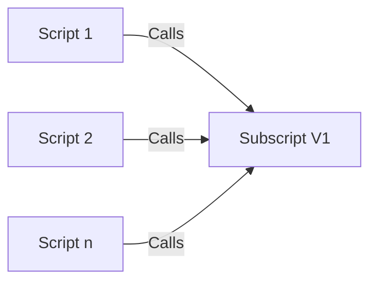
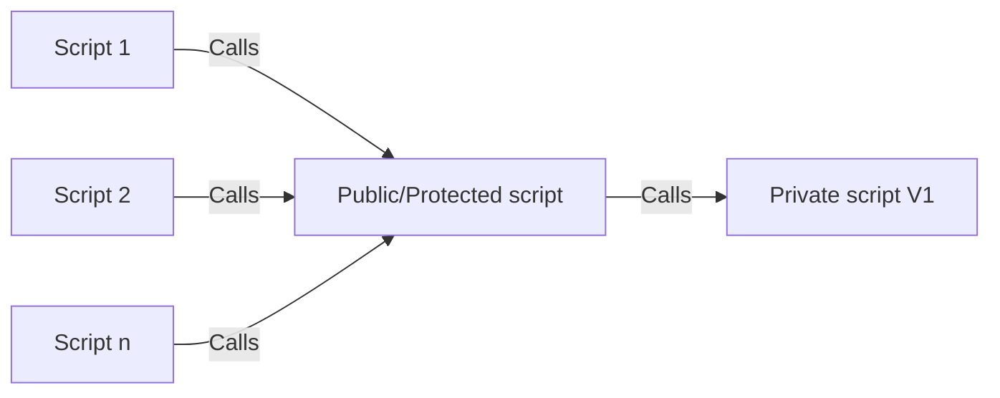
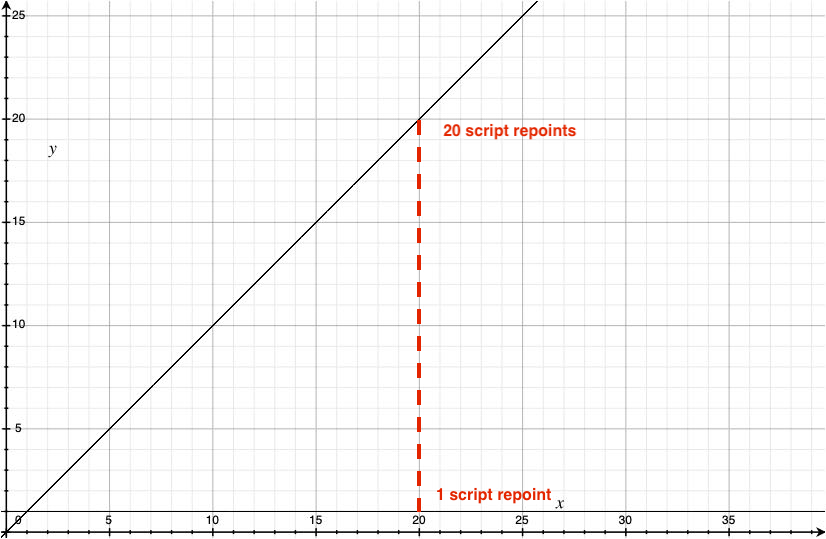

# Versions and Updating

## The Concept

Software development is always evolving to find ways of improving, centralizing and tightening up previously written code. As part of this process, the developer knows it is better to replace old code with newer more capable code, but the fear of breaking something stops them. If upgrading and rolling back was simple, fast, comprehensive and reliable, then developers would be much more inclined to do so and might even relish experimenting.

A particular script or function can be called from multiple places (other scripts, buttons, menus, script triggers, etc).

If you come out with a new and improved version of your script, you would have to repoint all the previous calls to the new version. 

If you discover a bug in your new version you would have to go back and repoint all the instances that you repointed originally.

Because of the overall headache of this and fear of breaking code, it is often easier just to leave all the old calls in place and just point any new scripts at the new function. 

This ends up producing a kind of stratified, archeological mess of code. In other words you can determing when something was written by seeing which subscripts it is calling or what techniques are used.

## Without Frameworks

- Any script can be called from anywhere
- Developers have to update __EVERY__ location a script is called from
  - If they miss a location, the system might behave differently there
  - If they need to roll back after a bug was discovered they have to reverse the process correctly 
- As files grow in size and complexity and as a script gets used more and more, this gets more and more difficult
  - If versioning gets too complicated, developers just move onto creating a new script and using it in any new place they code. 
    - Therefore, the script versions become like an archeological dig and an historical marker

#### Original script call (_n_ number of calls)

## With Frameworks

- Private scripts exist and can be versioned
- Calling scripts can specify which version they require or otherwise are defaulted to the current version
  - This is similar to many APIs (which can also take a version parameter)
- Private scripts are only ever called by one other script (either Public or Protected)
  - Therefore to switch versions, developers only have to switch one call
  - If they need to roll back after a bug was discovered they only have to revert one call
- As files grow in size and complexity and as a script gets used more and more, repointing it is still a one script change.
  - Therefore, there is an incentive to update scripts and experiment with solutions

#### Original script call (_n_ calls to Public/Protected, one call to Private)

- When you see the graph with both lines combined, it is obvious how much the Frameworks module reduces the number of calls.

- This difference gets more noticable the more you call a script.
  - If you call a script 5 times the difference is not too bad, if you call it 50 times it is much worse.
  - Also, if you point to a new script, then need to repoint (due to an error), it doubles the difference.
    - Without Framework 20 calls needing repointing become 40 calls
    - With Framework 20 calls needing repointing becomes 2 calls

## Summary

- Versioning in Frameworks allows quick, dependable, comprehensive version updating, testing and rolling back.

[Back](Introduction.md) - [Next](Script_Functions_And_Types.md)

[TOC](TOC.md)
