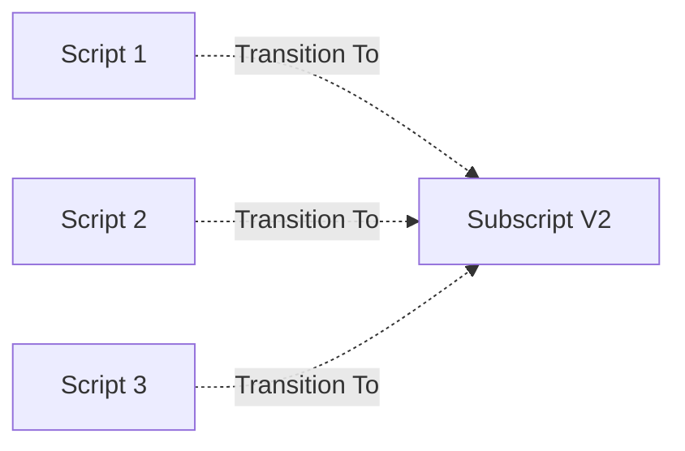
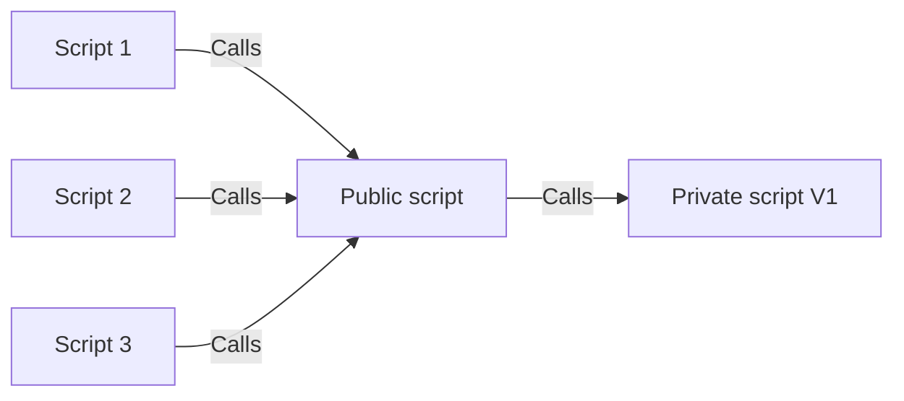
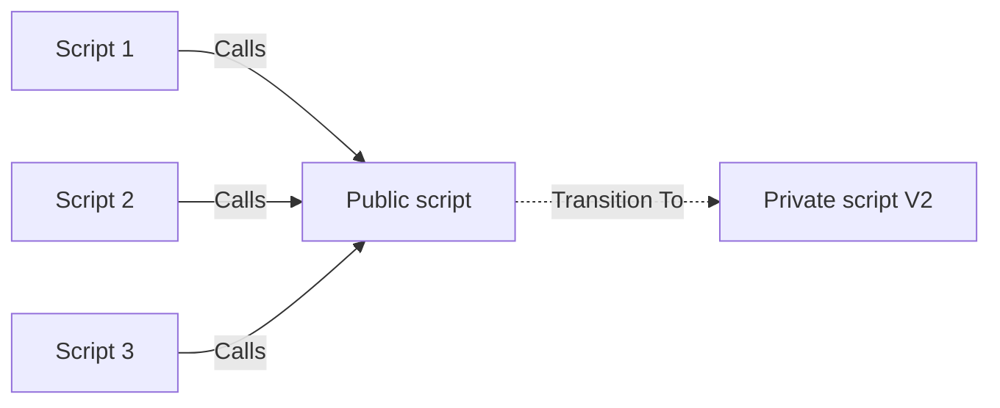

# Versions and Updating

## The Concept

Software development is always evolving to find ways of improving, centralizing and tightening up previously written code. As part of this process, the developer knows it is better to replace old code with a newer more capable code, but the fear of breaking something stops him. If upgrading and rolling back was simple, fast, comprehensive and reliable, then developers would be much more inclined to do so and might even relish experimenting.

A particular script or function can be called multiple times.

What do you need to do if you come out with a new version of your function?

It would be good if you could go back and repoint all the previous calls to the function and instantly replace it with the new function. 

What happens if you discover a bug in your new function? You then have to go back and repoint all the instances you spent all that time pointing in the first place. 

Because of the overall headache of this and fear of breaking code, it is often easier just to leave all the old calls in place and just point any new scripts at the new function. 

This ends up producing a kind of stratified, archeological mess of code. In other words you can determing when something was written by seeing which subscripts it is calling or what techniques are used.

## Without Frameworks

- There is no concept of a Private script, so any script can be called from anywhere
- Developers have to update every location a script is called from
  - If they miss a location, the system might behave differently there
  - If they need to roll back after a bug was discovered they have to reverse the process correctly 
- As files grow in size and complexity and as a script gets used more and more, this gets more and more difficult
  - If versioning gets too complicated, developers just move onto creating a new script and using it in any new place they code. 
    - Therefore, the script versions become like an archeological dig and an historical marker

## With Frameworks

- Private scripts exist and can be versioned
- Private scripts are only ever called by one other script (either Public or Private)
  - Therefore to switch versions, developers only have to switch one call
  - If they need to roll back after a bug was discovered they only have to reverse one call
- As files grow in size and complexity and as a script gets used more and more, repointing it is still a one script change.
  - Therefore, there is an incentive to update scripts and experiment with solutions

[Back](Introduction.md) - [Next](Script_Functions_And_Types.md)

[TOC](TOC.md)
