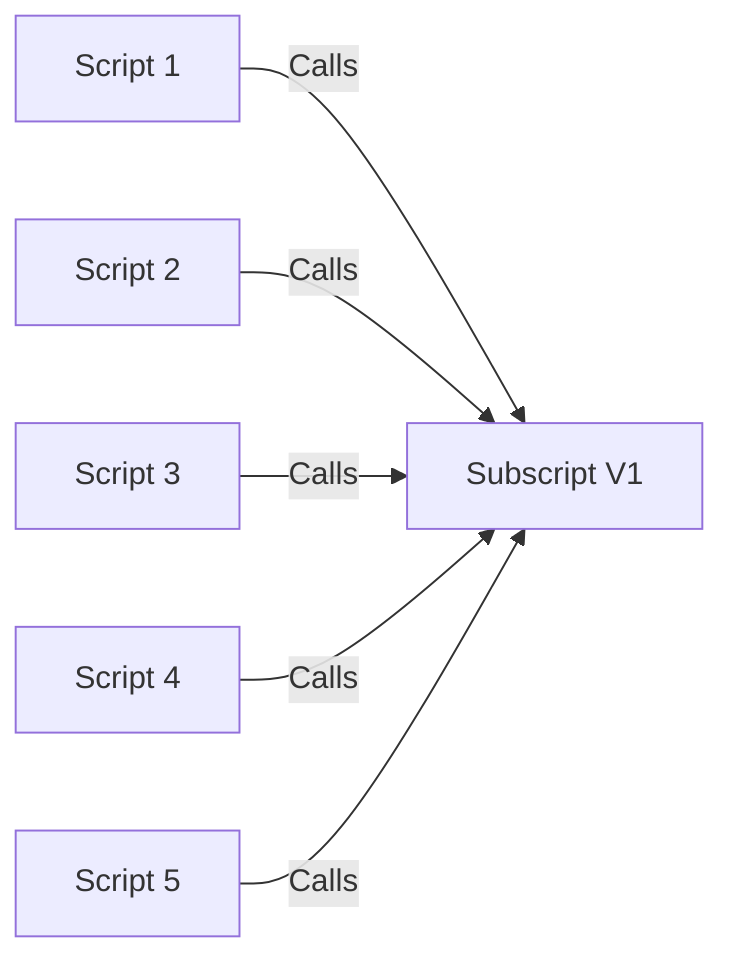
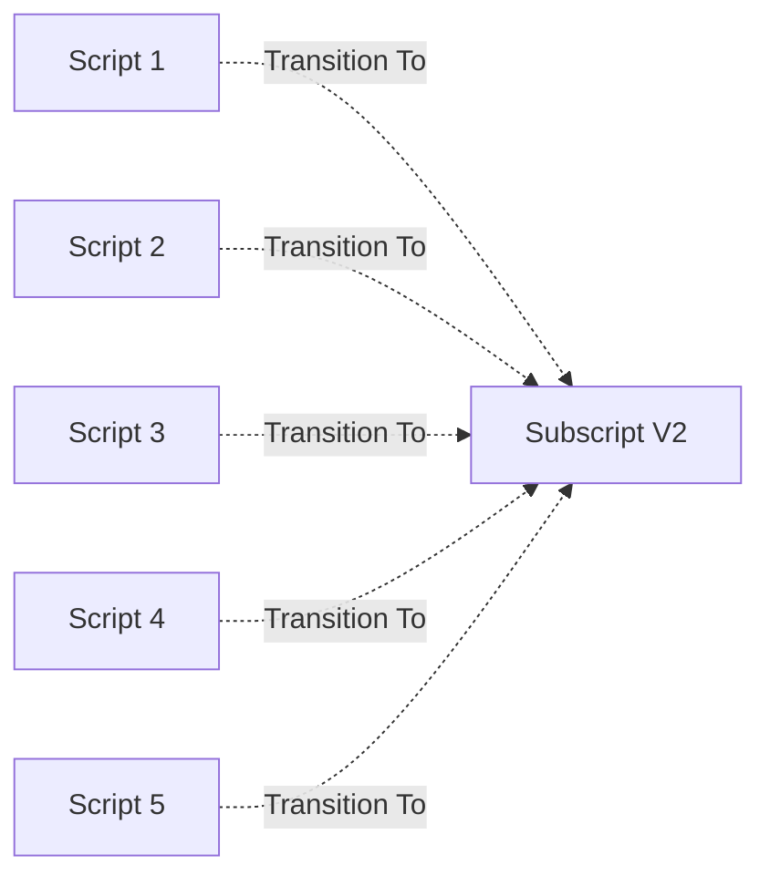
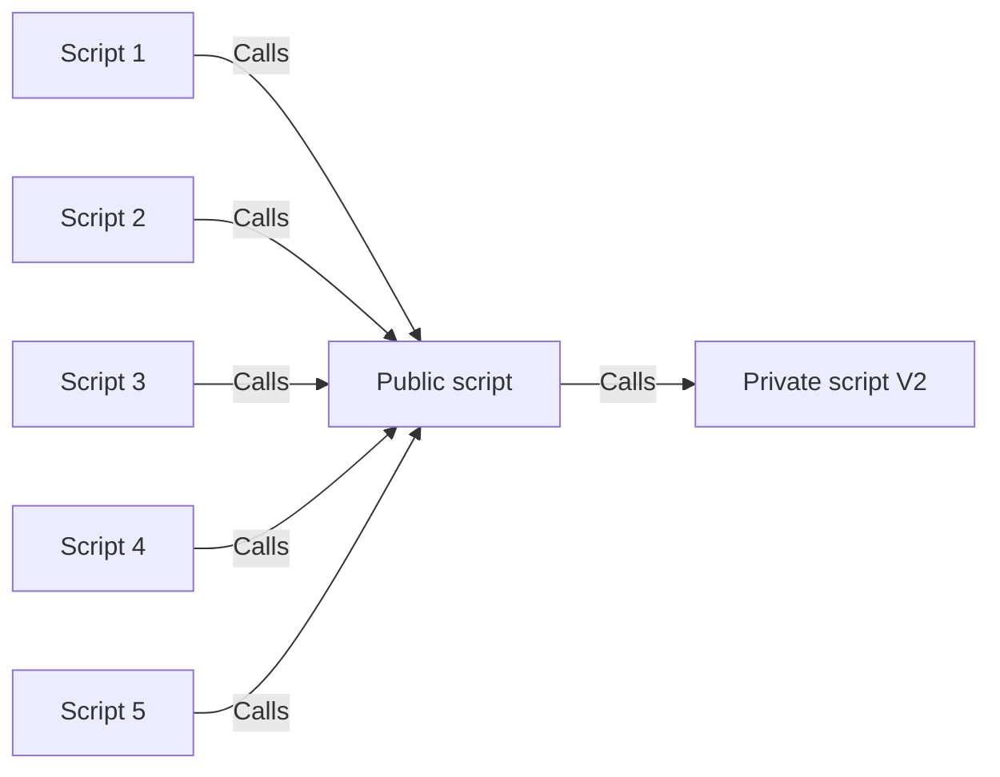

# Versions and Updating

## Common Versioning and Updating

- Developers have to update every location the script is called from
  - If they miss a location, the system might behave differently there
  - If they need to roll back after a bug was discovered they have to reverse the process correctly 
- As files grow in size and complexity and as a script gets used more and more, this gets more and more difficult
  - If versioning gets too complicated, developers just move onto creating a new script and using it in any new place they code. 
    - Therefore, the script versions become like an archeological dig and an historical marker

## Frameworks Versioning and Updating

- Developers have to update every location the script is called from
  - If they miss a location, the system might behave differently there
  - If they need to roll back after a bug was discovered they have to reverse the process correctly 
- As files grow in size and complexity and as a script gets used more and more, this gets more and more difficult
  - If versioning gets too complicated, developers just move onto creating a new script and using it in any new place they code. 
    - Therefore, the script versions become like an archeological dig and an historical marker

[Back](Introduction.md) - [Next](Script_Functions_And_Types.md)

[TOC](TOC.md)
