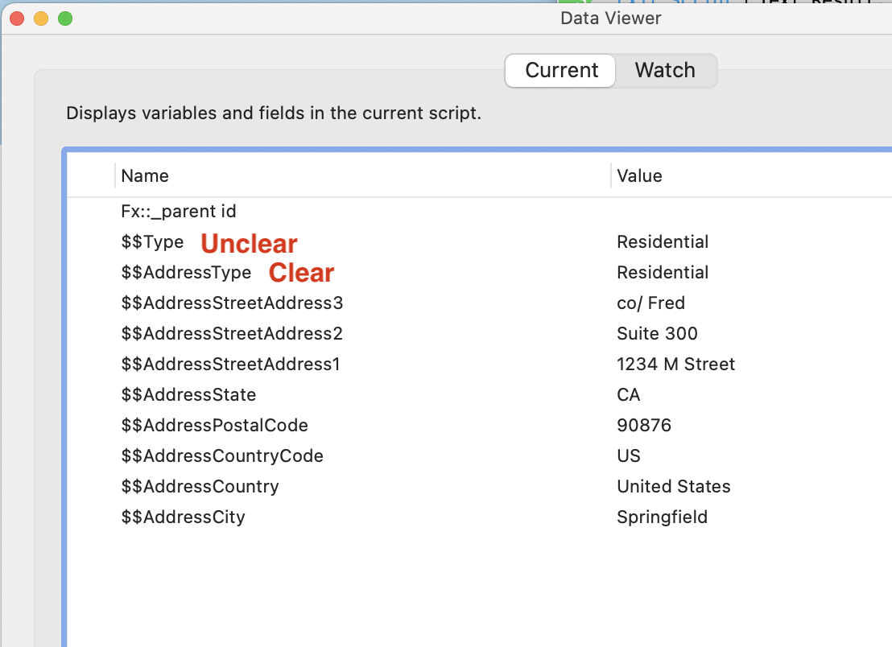
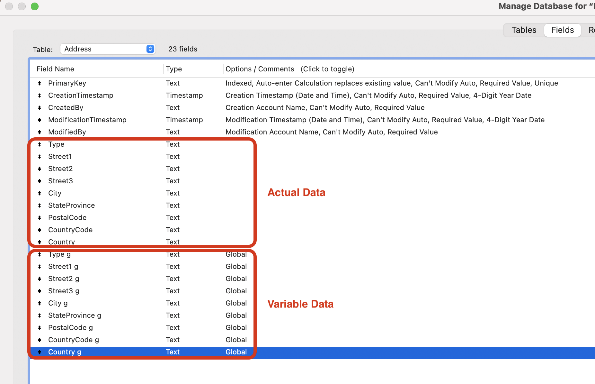
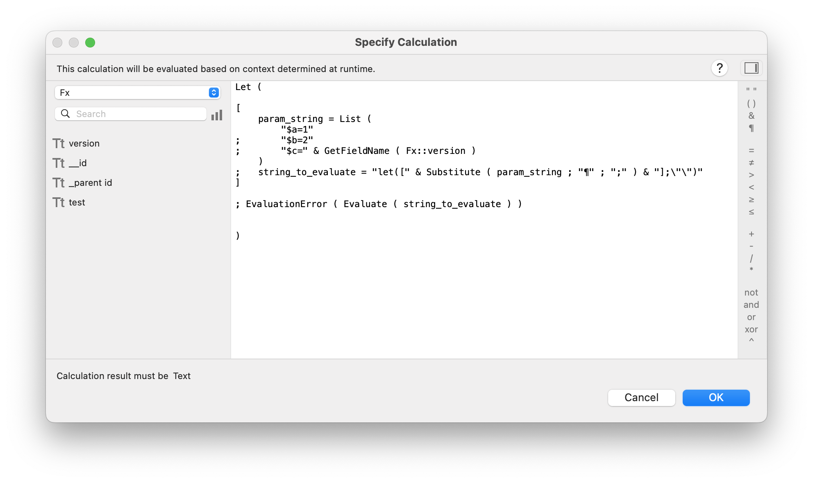
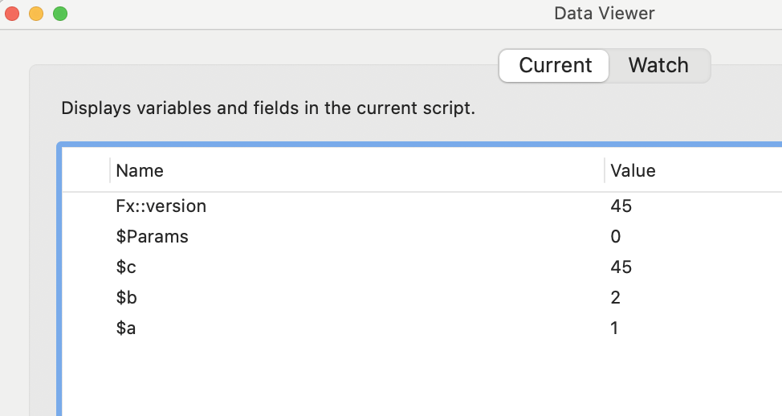
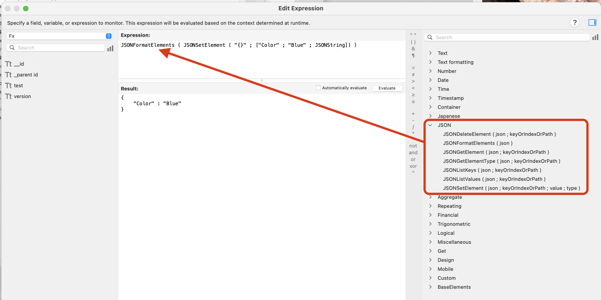

# Why use JSON for Parameters, Results, and Data Structures

## The Concept

- In every programming language there needs to be a method for setting parameters and returning results.
  - For many years, FileMaker only had text for this purpose.
    - Please see the historical examples shown below in rough order of appearance in FileMaker
  - This is fine if you have one parameter, but if you have multiple, named parameters this quickly becomes problematic.
- FileMaker 16 began supporting JSON as a method for setting parameters and returning results.
  - JSON is the most common data interchange language on the Web
- FX Frameworks uses JSON exclusively for setting parameters and returning results.

## Globals (in general)
- Every process can modify them
- Every process has access to them
- If their name is not specific enough, you might be using the wrong variable †
- There is no way to know if they were set for the currently running process, or were just never cleaned up after being used in a previous process
  - If they were set for a previous process, should the developer reset them
- In order to pass parameters or receive results across files, the Globals have to be duplicated in each file

†

## Global Fields (specifically)
- Data fields get intermingled with business function fields †
- No native way to represent data structures without duplicating data fields with global fields
- Global fields are really only useful in:
  - The left (non-indexed) side of data relationships
  - Simple data entry start screens

†

## Global Variables (specifically)
- They are not garbage collected by the system (cleaned up)
    - Until they are manually cleaned up, they consume memory
    - In contrast, local variables are cleaned up at the end of their calling process, releasing memory
- Cluttered up Data Viewer when debugging


## XML
- Can function similarly to JSON
- No native functions
- XML less human readable and more characters

XML (107 characters)
```
"<xml>"
 	"<old_master_id>Inactive</old_master_id>"
 	"<oldMasterStatus>123456</oldMasterStatus>"
 "</xml>"
```
JSON (64 characters)

```
{
	"oldMasterStatus" : "Inactive",
	"old_master_id" : "123456"
}
```
## Let function
- Slightly complex coding, but could be wrapped in Custom Function




## JSON
- JSON setting, getting, and typing are all natively supported in FileMaker
  - Previously to this, no consistently supported options

   

- JSON is default standard for web APIs
  - Broader range of developers are familiar
  - Easier to call and receive data from APIs external to FileMaker
- JSON more human readable and fewer characters (64 characters)

[Back](Custom_Functions.md) - Next

[TOC](TOC.md)
