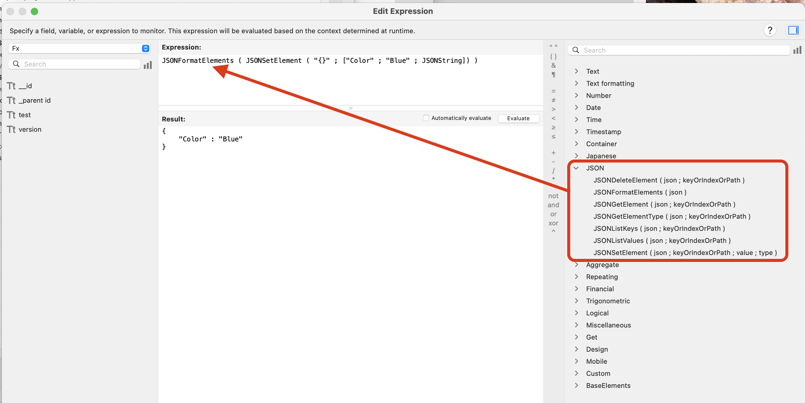
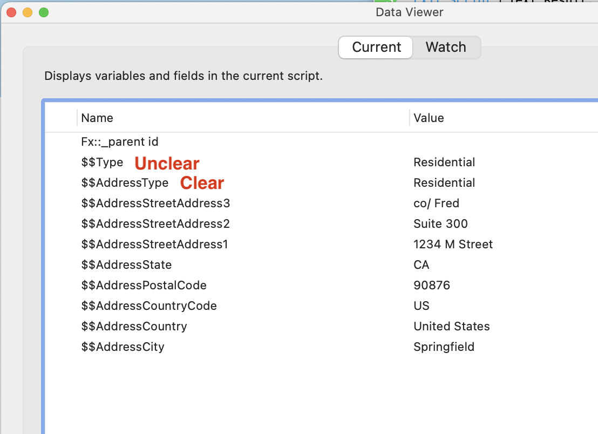
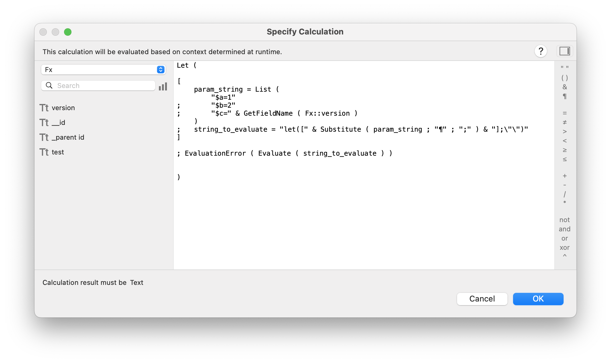
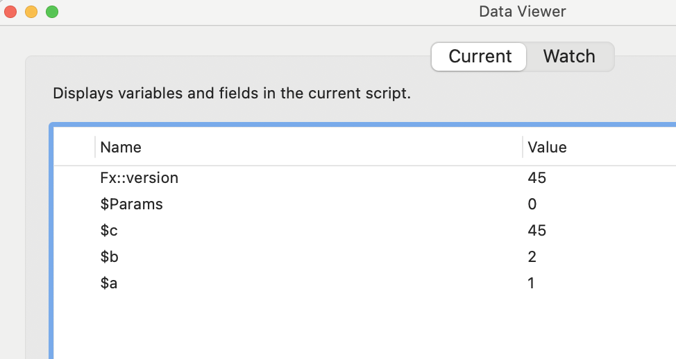
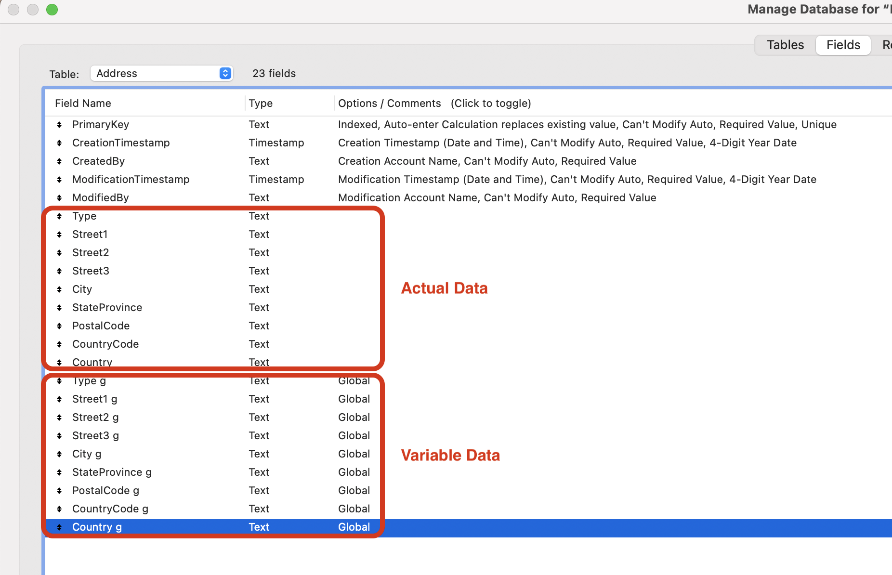

# Why use JSON for Parameters, Results, and Data Structures


## JSON
- JSON setting, getting, and typing are all natively supported in FileMaker
  - Previously to this, no consistently supported options
   
- JSON is default standard for web APIs
  - Broader range of developers are familiar
  - Easier to call and receive data from APIs external to FileMaker
- JSON more human readable and fewer characters (64 characters)
```
{
	"oldMasterStatus" : "Inactive",
	"old_master_id" : "123456"
}
```

## XML
- Can function similarly to JSON
- No native functions
- XML less human readable and more characters (108 characters)
```
"<xml>"
 	"<old_master_id>Inactive</old_master_id>"
 	"<oldMasterStatus>123456</oldMasterStatus>"
 "</xml>"
```

## Global Variables
- Global Variables issues generally:
  - Every process can modify them
  - Every process has access to them
  - They are not garbage collected by the system (cleaned up)
    - Until they are manually cleaned up, they consume memory
    - In contrast, local variables are cleaned up at the end of their calling process, releasing memory
  - Issues in practice:
    - Was global variable value set for this process, or just not cleaned up from previous process?
    - If you reset global variable for current process do you need to store previous value?
    - Did you reset global variable to value saved when you began current process?
       - Was this truly necessary? 
- Global Variable issues in FileMaker specifically:
  - Cluttered up Data Viewer when debugging
  - Unless strict naming convention, origin might be unclear
    - $$Type is unclear
    - $$Type_Customer is more clear 


## Let function
- Slightly complex coding, but could be wrapped in Custom Function



## Global Fields
- ALL the disadvantages of Global Variables with additional negatives
- Data fields get intermingled with business function fields
- Only useful as relationship starting points or simple data entry start screens
- No native way to represent data structures without duplicating data fields with global fields


[Back](Custom_Functions.md) - Next

[TOC](TOC.md)
